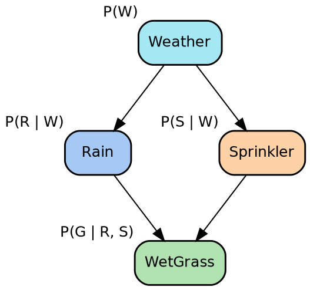
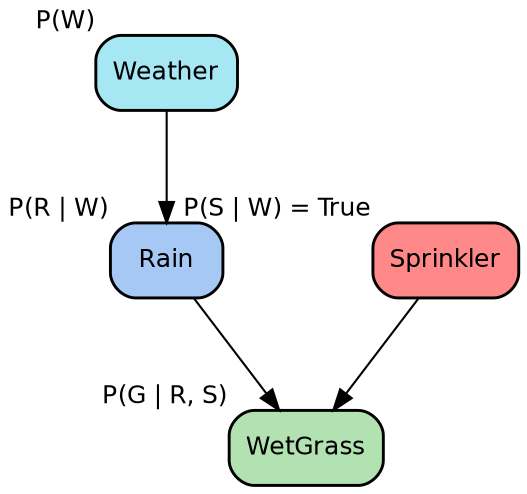
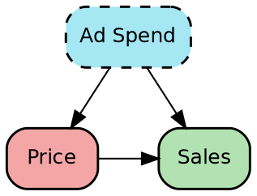

// Refs
//
// msml610/lectures_source/Lesson08.1-Causal_AI_intro.txt
// https://github.com/gpsaggese/gpsaggese.github.io/tree/master/msml610/lectures/Lesson08.1-Causal_AI_intro.pdf
//
// msml610/lectures_source/Lesson08.3-Do_Calculus.txt
// https://github.com/gpsaggese/gpsaggese.github.io/tree/master/msml610/lectures/Lesson08.3-Do_Calculus.pdf

# Counterfactual Reasoning

- Prediction models answer "what is likely to happen?" but they cannot answer
  "what would have happened if things had been different?"

- Counterfactual reasoning is the highest rung of Judea Pearl's Ladder of
  Causation: the ability to reason about alternate realities that never occurred

- This chapter explains what counterfactuals are, how they relate to
  interventions and associations, how to compute them from structural causal
  models, and how they are applied in ML explainability and treatment evaluation

## What Is a Counterfactual

// msml610/lectures_source/Lesson08.3-Do_Calculus.txt:156 "Counterfactuals"
// msml610/lectures_source/Lesson08.1-Causal_AI_intro.txt:278 "Rung 3: Counterfactuals"

- A **counterfactual** describes what _would have happened_ under a different
  scenario than what actually occurred
  - The word itself means "contrary to fact": it asks about a world that did not
    happen
  - _"What would the outcome have been, if X had been different?"_

- Counterfactuals are deeply natural to human reasoning
  - We ask counterfactual questions constantly in everyday life:
    - _"Would I have caught the train if I had left five minutes earlier?"_
    - _"Would the patient have survived if we had used a different drug?"_
    - _"Would the student have passed the exam without tutoring?"_

- In causal inference, a counterfactual is formalized as a statement about
  **potential outcomes**: for a specific individual or unit, what would the value
  of the outcome variable $Y$ have been, had the treatment or exposure $X$ been
  set to a different value than what was actually observed?

- **Notation**: $Y_{X=x}(u)$ denotes the value that $Y$ would have taken for
  unit $u$ had $X$ been set to $x$
  - E.g., $Y_{X=0}$ for a patient who actually received treatment ($X=1$) is
    the counterfactual outcome: what would have happened without treatment

- Counterfactuals differ from predictions in a fundamental way:
  - **Prediction**: _"Given current data, what will happen next?"_ (forward-looking)
  - **Counterfactual**: _"Given what actually happened, what would have happened
    under different conditions?"_ (backward-looking, about a specific case)

- **Business examples**
  - _"What if we had two suppliers instead of one? Would we have fewer delays?"_
  - _"Would customers be more satisfied if we shipped products in one week
    instead of three?"_
  - That's what businesses want, but they cannot get it from correlation-based
    models

- **Challenges**
  - Counterfactuals require strong assumptions and accurate causal models
  - They are difficult to validate directly since the counterfactual world is
    by definition unobservable: you can never see both the factual and
    counterfactual outcome for the same unit (the "fundamental problem of causal
    inference")

**References**

- Judea Pearl, _The Book of Why_ (2018), Chapter 1 and Chapter 8
- Donald Rubin, "Estimating Causal Effects of Treatments in Randomized and
  Nonrandomized Studies" (1974)
- Paul Holland, "Statistics and Causal Inference" (1986)
- Guido Imbens and Donald Rubin, _Causal Inference for Statistics, Social, and
  Biomedical Sciences_ (2015)

## Counterfactuals Vs. Interventions: the Three Rungs of the Ladder of Causation

// msml610/lectures_source/Lesson08.1-Causal_AI_intro.txt:230 "The Ladder of Causation"
// msml610/lectures_source/Lesson08.1-Causal_AI_intro.txt:245 "Rung 1: Association"
// msml610/lectures_source/Lesson08.1-Causal_AI_intro.txt:261 "Rung 2: Intervention"
// msml610/lectures_source/Lesson08.1-Causal_AI_intro.txt:278 "Rung 3: Counterfactuals"
// msml610/lectures_source/Lesson08.3-Do_Calculus.txt:44 "Interventions in Causal Networks"

- Pearl's **Ladder of Causation** provides a three-level framework for
  understanding the kinds of questions that causal reasoning can answer
  - Each rung requires strictly more information and modeling power than the one
    below it
  - A system that operates at rung $k$ cannot answer questions at rung $k+1$,
    no matter how much data it has

| **Level**          | **Symbol**           | **Activity** | **Typical Questions** |
| ------------------ | -------------------- | ------------ | --------------------- |
| 1. Association     | $\Pr(Y \mid X)$        | Observing    | What is?              |
| 2. Intervention    | $\Pr(Y \mid do(X), Z)$ | Intervening  | What if?              |
| 3. Counterfactuals | $\Pr(Y_X \mid x', y')$ | Imagining    | Why?                  |

### Rung 1: Association (Seeing)

- **Question**: _"How would seeing $X$ change our belief in $Y$?"_

- **In math terms**: $\Pr(Y \mid X)$

- **Activity**: passive observation to determine if $X$ and $Y$ are related
  - Traditional AI and ML operate at this level
  - In the best case, it is Bayesian updating; in the worst case, it is an
    overfitted model that captures spurious correlations

- **Examples**
  - _"What does a symptom tell you about a disease?"_
  - _"What does a survey tell you about election results?"_
  - _"Customers who bought X also bought Y"_ (recommendation systems)

- The key limitation: association cannot distinguish genuine causal relationships
  from spurious correlations or confounding

### Rung 2: Intervention (Doing)

- **Question**: _"What happens to $Y$ if you do $X$?"_

- **In math terms**: $\Pr(Y \mid do(X), Z)$

- **Activity**: understanding the impact of actively changing $X$ on $Y$, under
  conditions $Z$
  - Interventions involve "doing something" and require a causal model
  - This is fundamentally different from observation: $\Pr(Y \mid X) \ne \Pr(Y \mid do(X))$ in general

- The **do-operator** $do(X = x)$ represents performing an action that _sets_
  $X$ to $x$, rather than _observing_ $X = x$
  - It simulates an external manipulation: you reach into the system and force
    a variable to a particular value
  - This breaks the causal links into $X$, forming a "mutilated" graph

- E.g., in the sprinkler model, if you _observe_ that the sprinkler is on, you
  gain information about the weather (since weather affects the sprinkler)
- But if you _intervene_ and turn the sprinkler on manually ($do(S = true)$),
  you learn nothing about the weather: you broke the causal link from Weather
  to Sprinkler

- **Examples**
  - _"If you take aspirin, will your headache be cured?"_
  - _"What happens to sales if you lower the price by 10%?"_
  - _"What if you ban sodas in schools?"_

### Rung 3: Counterfactuals (Imagining)

- **Question**: _"Was it $X$ that caused $Y$?"_ or _"What if $X$ had been
  different?"_

- **In math terms**: $\Pr(Y_X \mid x', y')$: the probability that $Y$ would
  have taken value $y$ had $X$ been $x$, given that we actually observed $X = x'$
  and $Y = y'$

- **Activity**: imagining what would happen if the facts had been different
  - This is the highest form of causal reasoning because it requires
    understanding the full set of relationships between cause and effect
  - It goes beyond "what if we do X in general" (intervention) to "what would
    have happened in _this specific case_ if X had been different"

- **Examples**
  - _"A student received tutoring and scored 85%. What if they had not received
    tutoring?"_ The causal model estimates the alternative outcome (e.g., 70%)
  - _"The patient took the drug and died. Would the patient have survived
    without the drug?"_
  - _"My marketing campaign ran and sales stayed flat. Would sales have
    dropped without the campaign?"_

### Why the Distinction Matters

- Interventions answer general "what if" questions: _"What happens on average if
  we administer drug X?"_
- Counterfactuals answer specific, retrospective questions: _"Given that this
  patient took drug X and died, would they have survived without it?"_

- Counterfactuals require more information than interventions:
  - Interventions need the causal graph and the conditional distributions
  - Counterfactuals additionally need the **structural equations** (the
    functional form of each causal mechanism) and the ability to reason about
    specific units

- In practice, rung 2 questions can often be answered from observational data
  using techniques like back-door adjustment, front-door adjustment, or
  instrumental variables; rung 3 questions require the full structural causal
  model

**References**

- Judea Pearl, _Causality: Models, Reasoning, and Inference_ (2009), Chapters
  1, 3, and 7
- Judea Pearl and Dana Mackenzie, _The Book of Why_ (2018), Chapters 1-4
- Miguel Hernan and James Robins, _Causal Inference: What If_ (2020), Chapters
  1-3

## Computing Counterfactuals From Structural Causal Models

// msml610/lectures_source/Lesson08.3-Do_Calculus.txt:44 "Interventions in Causal Networks"
// msml610/lectures_source/Lesson08.3-Do_Calculus.txt:113 "The do-operator"
// msml610/lectures_source/Lesson08.3-Do_Calculus.txt:156 "Counterfactuals"

- A **Structural Causal Model (SCM)** consists of three components:
  1. **Endogenous variables** $V = \{V_1, \ldots, V_n\}$: the variables we
     model
  2. **Exogenous variables** $U = \{U_1, \ldots, U_n\}$: background factors
     outside the model (noise, unobserved causes)
  3. **Structural equations**: $V_i = f_i(\text{parents}(V_i), U_i)$ for each
     endogenous variable

- The structural equations encode the _mechanism_ by which each variable is
  determined by its direct causes and its noise term
  - This is strictly more informative than a Bayesian network, which only
    encodes conditional probability distributions

### The Three-Step Procedure for Computing Counterfactuals

- Pearl's framework provides a systematic three-step algorithm to compute any
  counterfactual $Y_{X=x}(u)$ from an SCM:

- **Step 1: Abduction** (update the exogenous variables)
  - Use the observed evidence (what actually happened) to infer the values of
    the exogenous (noise) variables $U$
  - This step "personalizes" the model to the specific case at hand
  - E.g., if a student scored 85 with tutoring, infer the student's latent
    ability $U$ from this observation

- **Step 2: Action** (modify the structural equations)
  - Perform the intervention: replace the structural equation for $X$ with the
    counterfactual value $X = x$
  - This is the same graph surgery as the do-operator: remove all arrows into
    $X$ and set it to the desired value
  - E.g., set $Tutoring = 0$ (no tutoring) in the modified model

- **Step 3: Prediction** (compute the outcome)
  - Use the modified model (with updated $U$ values from Step 1 and the
    intervention from Step 2) to compute the counterfactual outcome $Y$
  - E.g., propagate through the structural equations to compute what the
    student's score would have been without tutoring, given their inferred
    ability

### Example: Drug Efficacy

- Consider a simple SCM:
  - $U$: patient's underlying health (exogenous, unobserved)
  - $X$: whether the patient takes the drug (0 or 1)
  - $Y = f(X, U)$: recovery outcome

- **Observed fact**: patient took drug ($X = 1$) and recovered ($Y = 1$)

- **Counterfactual question**: _"Would the patient have recovered without the
  drug?"_ ($Y_{X=0}$)

- Apply the three steps:
  1. **Abduction**: from $X = 1, Y = 1$, infer $U = u^*$ (the patient's
     specific health state)
  2. **Action**: set $X = 0$ (no drug) in the structural equations
  3. **Prediction**: compute $Y = f(0, u^*) = ?$

- If the model yields $Y = 0$ (no recovery), then the drug was the cause of
  recovery for this patient
- If the model yields $Y = 1$ (recovery anyway), then the drug was not needed:
  the patient would have recovered regardless

### Interventions as a Special Case

- Interventional queries $\Pr(Y \mid do(X = x))$ can be seen as counterfactuals
  that are averaged over all units (all possible values of $U$)
  - This is why interventions require less information: you do not need to know
    the specific $U$ for a particular unit

- The do-operator formally removes $\Pr(X_j \mid \text{parents}(X_j))$ from
  the joint distribution:
  $$
  P_{X_j = x_j^k}(x_1, \ldots, x_n) =
  \begin{cases}
  \prod_{i \ne j} \Pr(x_i \mid \text{parents}(X_i)) & \text{if } X_j = x_j^k \\
  0 & \text{otherwise}
  \end{cases}
  $$

- The **adjustment formula** allows computing interventional effects from
  observational data when the back-door criterion is satisfied:
  $$\Pr(Y \mid do(X)) = \sum_z \Pr(Y \mid X, Z=z) \Pr(Z=z)$$

### Why SCMs Are Needed for Counterfactuals

- A standard Bayesian network encodes $\Pr(Y \mid X)$ but not the functional
  form $Y = f(X, U)$
- Two different SCMs can produce the same observational distribution and the
  same interventional distribution but give different counterfactual answers
- The structural equations carry information about _individual-level_ responses
  that cannot be recovered from population-level data alone

**References**

- Judea Pearl, _Causality: Models, Reasoning, and Inference_ (2009), Chapter 7:
  "The Logic of Structure-Based Counterfactuals"
- Ilya Shpitser and Judea Pearl, "What Counterfactuals Can Be Tested" (2007)
- Thomas Richardson and James Robins, "Single World Intervention Graphs" (2013)
- Jonas Peters, Dominik Janzing, and Bernhard Scholkopf, _Elements of Causal
  Inference_ (2017)

## Counterfactual Explanations for ML Predictions and Algorithmic Recourse

// msml610/lectures_source/Lesson08.1-Causal_AI_intro.txt:158 "Problem 3: ML Explainability"
// msml610/lectures_source/Lesson08.1-Causal_AI_intro.txt:179 "Causal AI"

- One of the most impactful applications of counterfactual reasoning is in
  **explaining the predictions of ML models** and providing **actionable
  recourse** to individuals affected by algorithmic decisions

### The Explainability Problem

- Many ML models (deep neural networks, ensemble methods) are "black boxes"
  - Humans cannot understand the input-to-conclusion process
  - This creates problems for:
    - **Regulators** who require explainability for decisions (e.g., hiring,
      lending, insurance)
    - **Stakeholders** who need to trust and defend model outputs
    - **Users** who deserve to understand why a decision was made about them

- Organizations that deploy unexplainable models face risks:
  - Being fined by authorities (e.g., GDPR "right to explanation")
  - Facing backlash from customers and activists
  - Perpetuating hidden biases (e.g., using age, race, sex as features)

### Counterfactual Explanations

- A **counterfactual explanation** answers: _"What is the smallest change to the
  input that would have led to a different output?"_
  - E.g., a loan application is denied. The counterfactual explanation might be:
    _"If your income had been \$5,000 higher, the loan would have been
    approved"_
  - This is more actionable than feature-importance-based explanations (e.g.,
    SHAP values), which say _what mattered_ but not _what to change_

- Formally, given a model $f$, an input $x$ with prediction $f(x) = y$, a
  counterfactual explanation finds $x'$ such that:
  - $f(x') = y'$ (the desired outcome)
  - $d(x, x')$ is minimized (the change is as small as possible)
  - $x'$ is plausible (the changed input is realistic)

- **Desirable properties** of counterfactual explanations:
  - **Proximity**: $x'$ should be close to $x$ (minimal change)
  - **Sparsity**: only a few features should change
  - **Plausibility**: the counterfactual should be a realistic data point
  - **Actionability**: the changes should involve features the person can
    actually change (e.g., income, not age or race)

### Algorithmic Recourse

- **Algorithmic recourse** goes one step further: it provides individuals with
  a set of actions they can take to change an unfavorable outcome
  - It combines counterfactual explanations with **causal knowledge** about
    which features can be changed and how they affect each other

- Without causal reasoning, counterfactual explanations can suggest impossible
  or misleading changes:
  - _"If you were 10 years younger, your insurance premium would be lower"_ is
    a valid counterfactual but not actionable
  - _"If you reduced your BMI by 5 points, your premium would decrease"_ is
    both counterfactual and actionable

- Causal counterfactual explanations respect the causal structure:
  - Changing one feature propagates effects through the causal graph
  - E.g., increasing education may increase income, which in turn improves
    credit score: the explanation accounts for these downstream effects

### Connection to Causal AI

- Counterfactual explanations are a natural application of Pearl's Ladder:
  - Standard ML operates at rung 1 (association): _"What features correlate
    with the prediction?"_
  - Counterfactual explanations operate at rung 3: _"What would have happened
    if the features had been different?"_

- Causal AI ensures fairness by accounting for confounding variables
  - Traditional AI can be biased by training data and ignored variables
  - Counterfactual fairness: a decision is fair if it would have been the same
    in a counterfactual world where the individual belonged to a different
    demographic group

**References**

- Sandra Wachter, Brent Mittelstadt, and Chris Russell, "Counterfactual
  Explanations Without Opening the Black Box" (2017)
- Amir-Hossein Karimi et al., "A Survey of Algorithmic Recourse" (2022)
- Matt Kusner et al., "Counterfactual Fairness" (NeurIPS 2017)
- Chris Russell et al., "Efficient Search for Diverse Coherent Explanations"
  (2019)
- Rafael Poyiadzi et al., "FACE: Feasible and Actionable Counterfactual
  Explanations" (2020)
- Christoph Molnar, _Interpretable Machine Learning_ (2022), Chapter on
  Counterfactual Explanations

## Applications: What Would Have Happened Without the Treatment?

// msml610/lectures_source/Lesson08.3-Do_Calculus.txt:207 "Randomized Controlled Trial"
// msml610/lectures_source/Lesson08.3-Do_Calculus.txt:156 "Counterfactuals"
// msml610/lectures_source/Lesson08.1-Causal_AI_intro.txt:145 "Problem 2: Decision Making"

- The most classic application of counterfactual reasoning is **treatment effect
  estimation**: _"What would have happened to this individual (or this group) if
  they had not received the treatment?"_

### The Fundamental Problem of Causal Inference

- For any individual, you can only observe _one_ outcome: the factual one
  - If a patient took the drug and recovered, you cannot observe what would have
    happened without the drug
  - The counterfactual outcome is always missing

- The **individual treatment effect (ITE)** is defined as:
  $$\text{ITE} = Y_{X=1}(u) - Y_{X=0}(u)$$
  - This is inherently unobservable for any single unit

- The **average treatment effect (ATE)** averages over the population:
  $$\text{ATE} = E[Y_{X=1}] - E[Y_{X=0}]$$
  - This can be estimated under certain conditions

### Randomized Controlled Trials

- **RCTs** are the gold standard for estimating causal effects
  - Randomly assign treatment, ensuring groups are statistically equivalent
    except for the treatment
  - Randomization simulates the do-operator by removing incoming arrows to $X$
  - This allows using $\Pr(Y \mid X)$ to measure $\Pr(Y \mid do(X))$

- **Example**: _"Does offering an after-school tutoring program increase the
  probability that a student passes the end-of-term exam?"_
  - Students are randomly assigned to treatment ($X=1$, tutoring) or control
    ($X=0$, no tutoring)
  - Randomization ensures balance on prior GPA, motivation, parental income
  - Compare outcomes: $Y_{X=1} - Y_{X=0}$

- **Limitations of RCTs**:
  - May be unethical (e.g., assigning harmful treatment, testing if asbestos
    causes cancer)
  - Can be expensive or impractical at scale
  - Non-compliance: some participants may not follow assigned treatment
  - Attrition: dropout rates may differ between groups
  - May not generalize to broader populations

### Observational Studies With Causal Adjustments

- When RCTs are not feasible, counterfactual reasoning combined with causal
  graphs allows treatment effect estimation from observational data

- **Back-door adjustment**: if a set of variables $Z$ blocks all back-door
  paths from treatment $X$ to outcome $Y$:
  $$\Pr(Y \mid do(X)) = \sum_z \Pr(Y \mid X, Z=z) \Pr(Z=z)$$

- **Front-door adjustment**: if a mediator $M$ transmits all causal influence
  from $X$ to $Y$ and no unobserved confounder affects $X$ and $M$:
  $$\Pr(Y \mid do(X)) = \sum_m \Pr(M \mid X) \sum_{x'} \Pr(Y \mid M, X') \Pr(X')$$

- **Example**: a company wants to understand the causal effect of _price_ on
  _sales_, but advertising spend is a confounder

  - The back-door path $Price \leftarrow AdSpend \rightarrow Sales$ creates a
    spurious association
  - Conditioning on $AdSpend$ blocks this path and allows estimating the true
    causal effect of price on sales

### Applications Across Domains

- **Medicine**: _"Would the patient have survived without the surgery?"_
  - Estimate individual treatment effects for personalized medicine
  - Compare treatments that cannot be ethically randomized

- **Policy**: _"Did the job training program reduce unemployment?"_
  - Evaluate government programs using observational data
  - Counterfactual: _"What would unemployment have been for participants had
    they not enrolled?"_

- **Business**: _"What if we had not run the marketing campaign?"_
  - Attribution: estimate the causal contribution of each marketing channel
  - Counterfactual impact: compare actual revenue to estimated revenue without
    the campaign

- **Legal and litigation**: _"Was the defendant's action the cause of the
  harm?"_
  - Courts often reason counterfactually: _"But for the defendant's action,
    would the harm have occurred?"_
  - Causal models formalize this "but-for" test

- **Supply chain**: _"What if we had two suppliers instead of one? Would we have
  fewer delays?"_
  - Simulate alternative supply chain configurations
  - Estimate the counterfactual number of disruptions under each scenario

**References**

- Miguel Hernan and James Robins, _Causal Inference: What If_ (2020)
- Guido Imbens and Donald Rubin, _Causal Inference for Statistics, Social, and
  Biomedical Sciences_ (2015)
- Judea Pearl, _The Book of Why_ (2018), Chapter 8: "Counterfactuals"
- Stefan Kunzel et al., "Metalearners for Estimating Heterogeneous Treatment
  Effects Using Machine Learning" (2019)
- Victor Chernozhukov et al., "Double/Debiased Machine Learning for Treatment
  and Structural Parameters" (2018)
- Susan Athey and Guido Imbens, "Recursive Partitioning for Heterogeneous
  Causal Effects" (2016)
