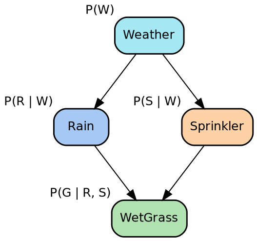
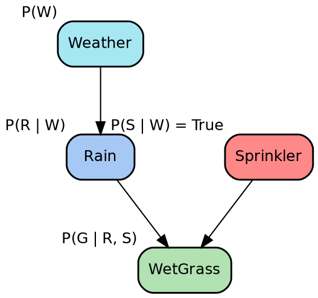
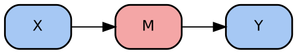
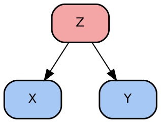
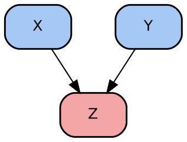
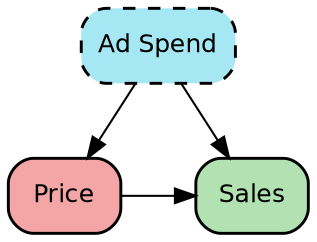
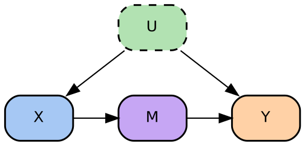
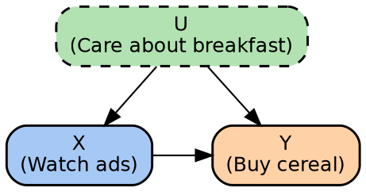
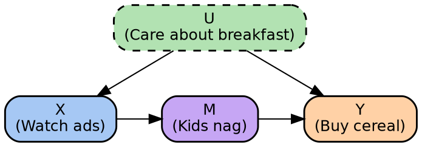
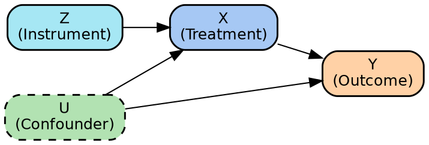

# Causal Identification
// msml610/lectures_source/Lesson08.3-Do_Calculus.txt
// https://github.com/gpsaggese/gpsaggese.github.io/tree/master/msml610/lectures/Lesson08.3-Do_Calculus.pdf

## The Identification Problem: When Can We Estimate Causal Effects From Data?

// msml610/lectures_source/Lesson08.3-Do_Calculus.txt:42 "Intervention and Counterfactuals"
// msml610/lectures_source/Lesson08.3-Do_Calculus.txt:113 "Interventions in Causal Networks"

- The central question of causal inference is: _"Can we compute the effect of an
  intervention from the data we actually have?"_
  - This is the **identification problem**: determining whether a causal quantity
    (e.g., $\Pr(Y \mid do(X))$) can be expressed purely in terms of observed data

- Knowing a correlation exists between two variables is not enough
  - Correlation tells us that $X$ and $Y$ move together
  - It does not tell us whether changing $X$ would actually change $Y$
  - The gap between observation and intervention is what makes causal
    identification necessary

- **The do-operator** formalizes intervention
  - $do(X = x)$ means we physically set $X$ to a value $x$, overriding its
    natural causal mechanism
  - This is fundamentally different from passively observing $X = x$
  - Observing $X = x$ carries information about the causes of $X$ (e.g.,
    confounders), whereas intervening on $X$ breaks those incoming causal links

- Formally, the do-operator modifies the joint distribution by removing the
  factor for $X$ from the causal factorization:
  $$
  P_{X = x}(x_1, \ldots, x_n) =
  \begin{cases}
  \prod_{i \ne j} \Pr(x_i \mid \text{parents}(X_i)) & \text{if } X_j = x_j \\
  0 & \text{otherwise}
  \end{cases}
  $$
  - The intervention creates a **mutilated graph** where all arrows pointing into
    $X$ are removed

- **Example: sprinkler and wet grass**

// msml610/lectures_source/Lesson08.3-Do_Calculus.txt:61 "Interventions in Causal Networks"

  - Consider the classic causal graph: Weather causes both Rain and Sprinkler,
    and both Rain and Sprinkler cause WetGrass

  - Observing $Sprinkler = \text{true}$ tells us something about the weather
    (information flows backwards along the causal arrow)
  - Intervening with $do(Sprinkler = \text{true})$ (manually turning the
    sprinkler on) tells us nothing about the weather because the arrow from
    Weather to Sprinkler is cut

  - Under the intervention $do(S = \text{true})$, the new distribution becomes:
    $$\Pr(c, r, w, g \mid do(S = \text{true})) = \Pr(c)\Pr(r \mid c)\Pr(w \mid r, S = \text{true})\Pr(g \mid w)$$
  - Only descendants of Sprinkler (i.e., WetGrass) change; Weather and Rain
    remain unaffected

- **Why identification matters**
  - If a causal effect is **identifiable**, we can compute it from observational
    data alone, without running an experiment
  - If it is **not identifiable**, no amount of observational data will suffice,
    and we need experimental data or additional assumptions
  - The tools for identification (back-door criterion, front-door criterion,
    instrumental variables, do-calculus) form the core toolkit of this chapter

- **Randomized Controlled Trials (RCTs)** are the gold standard for
  identification

// msml610/lectures_source/Lesson08.3-Do_Calculus.txt:208 "Randomized Controlled Trial"

  - RCTs estimate causal effects by comparing treatment and control groups
  - Random assignment simulates the do-operator: it removes incoming arrows to
    the treatment variable, eliminating confounding
  - Under randomization, $\Pr(Y \mid X) = \Pr(Y \mid do(X))$, so we can use
    observed conditional probabilities directly

- **Example: tutoring and exam scores**

// msml610/lectures_source/Lesson08.3-Do_Calculus.txt:228 "Randomized Controlled Trial: Example"

  - Research question: _"Does offering an after-school tutoring program increase
    the probability that a student passes the end-of-term exam?"_
  - Students are randomly assigned to treatment ($X = 1$, tutoring) or control
    ($X = 0$, no tutoring)
  - Randomization ensures balance on prior GPA, motivation, parental income, etc.
  - The causal effect is measured as $Y_{X=1} - Y_{X=0}$

- **Limits of RCTs**

// msml610/lectures_source/Lesson08.3-Do_Calculus.txt:249 "Randomized Controlled Trial: Limits"

  - RCTs may be **unethical** (e.g., you cannot assign harmful treatments like
    asbestos exposure to test if it causes cancer)
  - They can be **expensive or impractical** (e.g., randomizing government
    policies across countries)
  - They may **not generalize** to broader populations
  - **Non-compliance** (participants not following assigned treatment) and
    **attrition** (differential dropout) can bias results
  - **Blind RCT**: participants don't know which group they are in (e.g.,
    placebo)
  - **Double-blind RCT**: neither participants nor investigators know assignments

- When RCTs are not feasible, we need methods to identify causal effects from
  **observational data** alone
  - This is where the back-door criterion, front-door criterion, instrumental
    variables, and do-calculus come in

## Backdoor and Frontdoor Criteria

### Chains, Forks, and Colliders

// msml610/lectures_source/Lesson08.3-Do_Calculus.txt:353 "Chains, Forks, and Colliders"

- Before understanding the back-door and front-door criteria, we need to
  understand the three fundamental building blocks of causal graphs

- **Chain**: $X \rightarrow M \rightarrow Y$

  - $M$ is a **mediator** that transmits the causal effect from $X$ to $Y$
  - Conditioning on $M$ **blocks** the causal effect: do not condition on
    mediators if you want to estimate the total causal effect of $X$ on $Y$

- **Fork**: $X \leftarrow Z \rightarrow Y$

  - $Z$ is a **common cause** (confounder) of $X$ and $Y$
  - Conditioning on $Z$ **removes confounding**: this is exactly what you need
    to do to isolate the causal effect

- **Collider**: $X \rightarrow M \leftarrow Y$

  - $M$ is a **common effect** of $X$ and $Y$
  - Conditioning on a collider **introduces** spurious association: do not
    condition on colliders

- The key insight is that whether you should or should not condition on a
  variable depends entirely on its structural role (chain, fork, or collider) in
  the causal graph

### The Back-Door Criterion

// msml610/lectures_source/Lesson08.3-Do_Calculus.txt:269 "Back-Door Paths: Example"
// msml610/lectures_source/Lesson08.3-Do_Calculus.txt:316 "The Back-Door Adjustment"

- A **back-door path** is any path from $X$ to $Y$ that starts with an arrow
  **into** $X$
  - These paths create spurious associations between $X$ and $Y$
  - They make $X$ and $Y$ look related even when changing $X$ would not change $Y$

- **Back-door criterion**: A set of variables $Z$ satisfies the criterion relative
  to $(X, Y)$ if:
  1. No variable in $Z$ is a **descendant** of $X$
  2. $Z$ **blocks every** back-door path from $X$ to $Y$

- When the back-door criterion is satisfied, the **adjustment formula** holds:
  $$\Pr(Y \mid do(X)) = \sum_z \Pr(Y \mid X, Z = z) \Pr(Z = z)$$

- This result is profound: it allows us to compute an **interventional** quantity
  (level 2 of Pearl's causal ladder) using only **observational** data (level 1)
  - Under the right conditions, correlation does imply causation

- **Example: price, advertising, and sales**

// msml610/lectures_source/Lesson08.3-Do_Calculus.txt:269 "Back-Door Paths: Example"

  - A company wants to understand the causal effect of Price on Sales
  - Advertising spend (AdSpend) is a **confounder**: it affects both the price
    the company can set and sales directly
  - The back-door path is $Price \leftarrow AdSpend \rightarrow Sales$

\begin{center}
  \includegraphics[width=0.5\textwidth]{msml610/lectures_source/figures/L08.3_Lesson09-Price_Quantity.png}
\end{center}

  - To estimate the causal effect of Price on Sales, the company needs to
    **control for AdSpend** using one of:
    1. Including AdSpend as a covariate in regression
    2. Designing an experiment holding AdSpend constant or randomized
    3. Using the back-door criterion

### Common Mistakes with the Back-Door Criterion

// msml610/lectures_source/Lesson08.3-Do_Calculus.txt:443 "Common Mistakes"

- Before the back-door criterion, the standard approach was to "condition on
  everything available"
  - **This is incorrect** and can introduce bias rather than remove it

- **Common mistakes**:
  - **Conditioning on a descendant of $X$**: can bias the estimate
  - **Controlling for too many variables**: can open collider paths and introduce
    spurious associations
  - **Forgetting to block all back-door paths**: leaves residual confounding
  - **Conditioning on a mediator**: blocks the causal pathway you are trying to
    measure (the chain case)
  - **Ignoring unobserved confounders**: can make the causal effect
    unidentifiable

- Thousands of papers in medicine, economics, and social science have drawn
  incorrect conclusions because they conditioned on the wrong variables in
  observational studies

### When the Back-Door Criterion Fails

// msml610/lectures_source/Lesson08.3-Do_Calculus.txt:464 "When Back-Door Adjustment Fails"

- The back-door criterion is simple but **not universally applicable**
  - No set of observable variables may satisfy the criterion (e.g., when there
    are unobserved or unknown confounders)
  - You need to know a good approximation of the true causal graph, and it is
    very easy to omit variables

- **Alternatives** when back-door adjustment fails:
  - **Front-door criterion**: uses mediators to identify the effect
  - **Instrumental variables**: uses external sources of variation
  - **Do-calculus**: provides a complete set of symbolic transformation rules

### The Front-Door Criterion

// msml610/lectures_source/Lesson08.3-Do_Calculus.txt:479 "Front-Door Adjustment in Causal Inference"

- The **front-door criterion** identifies causal effects even in the presence of
  unobserved confounders
  - It applies when a **mediator variable** $M$ transmits all causal influence
    from treatment $X$ to outcome $Y$

- **Hypotheses** for the front-door criterion:
  1. All directed paths from $X$ to $Y$ go through $M$
  2. No unobserved confounder affects both $X$ and $M$
  3. All back-door paths from $M$ to $Y$ are blocked by $X$

- **The front-door adjustment formula**:
  $$P(Y \mid do(X)) = \sum_m P(M \mid X) \sum_{x'} P(Y \mid M, X') P(X')$$
  - _Intuition_: decompose the causal effect into two observable pieces: "How $X$
    causes $M$" and "How $M$ causes $Y$"

- **Example: cereal ads, nagging kids, and buying behavior**

// msml610/lectures_source/Lesson08.3-Do_Calculus.txt:529 "Cereal and Ads: Example"
// msml610/lectures_source/Lesson08.3-Do_Calculus.txt:592 "Cereal and Ads: Finding a Mediator"

  - Research question: _"Does watching ads ($X$) make people buy more cereal
    ($Y$)?"_
  - The naive answer is "yes, of course" but there is a hidden confounder:
    parents who care about breakfast ($U$) might let kids watch more TV (seeing
    more ads) and also buy more cereal anyway

  - A spurious relationship is terrible for the business: it means you spend
    money on ads that don't actually drive purchases
  - This is a high-stakes question: Google and Facebook are worth trillions, and
    their business model depends on "watch ads" $\implies$ "buy stuff"

  - The **mediator**: ads work by making kids nag their parents for cereal ($M$)
    - This is a real advertising strategy: at convenience stores, candies are
      placed at the bottom of the shelf so children can see them

\begin{center}
  \includegraphics[width=0.5\textwidth]{msml610/lectures_source/figures/L08.3.Nagging_kids.png}
\end{center}

  - The causal chain becomes: Ads ($X$) $\to$ Kids Nagging ($M$) $\to$ Parents
    Buy Cereal ($Y$), with the hidden factor $U$ affecting $X$ and $Y$ but not
    $M$

// msml610/lectures_source/Lesson08.3-Do_Calculus.txt:644 "When Front-Door Works"

  - **Is the front-door criterion verified?**
    - All influence of ads on buying goes through nagging ($X \to M \to Y$)
    - No hidden confounders affect both ads and nagging (TV schedule is random,
      not linked to parents' breakfast attitudes)
    - All confounding between nagging and buying is blocked by controlling for ads
  - **Yes, the front-door criterion is verified**

  - Instead of running an experiment, we can just observe:
    1. How often ads make kids nag: $\Pr(M \mid X)$
    2. How nagging changes buying: $\Pr(Y \mid M, X')$
    3. Combine both:
       $$\Pr(Y \mid do(X)) = \sum_m \Pr(M \mid X) \sum_{x'} \Pr(Y \mid M, X') \Pr(X')$$

### Do-Calculus: The General Framework

// msml610/lectures_source/Lesson08.3-Do_Calculus.txt:690 "Do-Calculus"

- **Do-calculus** is a formal system for reasoning about causal effects in
  graphical models, introduced by Judea Pearl in 2000

- The problem: you care about $\Pr(Y \mid do(X = x))$ but you only have
  observational data $\Pr(Y \mid X = x)$
  - In general, these two quantities are not equal because of confounding

- Do-calculus provides **three algebraic rules** to transform intervention
  expressions into observational expressions, given certain graphical conditions

// msml610/lectures_source/Lesson08.3-Do_Calculus.txt:713 "The Rules of Do-Calculus"

  1. **Rule 1 (Insertion/Deletion of Observations)**: If $Y \perp Z \mid X, W$
     in $G_{\overline{X}}$ (graph with incoming edges to $X$ removed), then:
     $$\Pr(Y \mid do(X), Z, W) = \Pr(Y \mid do(X), W)$$

  2. **Rule 2 (Action/Observation Exchange)**: If $Y \perp Z \mid X, W$ in
     $G_{\overline{X}, \underline{Z}}$ (incoming edges to $X$ removed, outgoing
     from $Z$ removed), then:
     $$\Pr(Y \mid do(X), do(Z), W) = \Pr(Y \mid do(X), Z, W)$$

  3. **Rule 3 (Insertion/Deletion of Actions)**: If $Y \perp Z \mid X, W$ in
     $G_{\overline{X}, \overline{Z(W)}}$, then:
     $$\Pr(Y \mid do(X), do(Z), W) = \Pr(Y \mid do(X), W)$$

- These rules allow the systematic reduction of do-expressions into purely
  observational terms, whenever the causal graph permits

// msml610/lectures_source/Lesson08.3-Do_Calculus.txt:735 "Back/Front-door Adjustments and Do-calculus"

- The **back-door** and **front-door** criteria are **special cases** of
  do-calculus
  - They are simpler, graphical shortcuts that can be derived using the three
    rules of do-calculus
  - Do-calculus is more general: it can identify causal effects in situations
    where neither the back-door nor the front-door criterion applies
  - Pearl proved that do-calculus is **complete**: if a causal effect can be
    identified from a given graph, do-calculus will find the expression

## Instrumental Variables and Natural Experiments

- **Instrumental Variables (IV)** provide another strategy for causal
  identification when direct adjustment is not possible

- An **instrument** $Z$ is a variable that:
  1. Is correlated with the treatment $X$ (**relevance**)
  2. Affects the outcome $Y$ only through $X$ (**exclusion restriction**)
  3. Is not associated with confounders of $X$ and $Y$ (**independence**)

- _Intuition_: the instrument acts as a "natural experiment" that shifts the
  treatment $X$ without being contaminated by confounders
  - The variation in $X$ that is driven by $Z$ is as good as random

- **Classic examples of instruments**:
  - **Draft lottery numbers** as an instrument for military service (to study its
    effect on earnings)
  - **Distance to college** as an instrument for years of education (to study the
    effect of education on wages)
  - **Rainfall** as an instrument for agricultural output (to study the effect of
    income on conflict)

- **Natural experiments** occur when some external event or policy creates
  variation that mimics random assignment
  - E.g., a policy change that affects some regions but not others
  - The "treatment" is not assigned by a researcher but by circumstances
  - If the circumstances satisfy the IV conditions, they can be used for causal
    identification

- **Limitations of IV**:
  - Finding a valid instrument is often the hardest part
  - The exclusion restriction (instrument affects outcome only through treatment)
    is untestable
  - IV estimates the **Local Average Treatment Effect (LATE)**, which applies
    only to the subpopulation whose treatment is affected by the instrument
    ("compliers"), not the entire population
  - Weak instruments (those only weakly correlated with treatment) lead to biased
    and imprecise estimates

## Regression Discontinuity and Difference-in-differences

### Regression Discontinuity Design (RDD)

- **Regression Discontinuity** exploits a threshold or cutoff rule that
  determines treatment assignment
  - Treatment is assigned based on whether a "running variable" $R$ falls above
    or below a cutoff $c$
  - E.g., students with test scores above 80 receive a scholarship; those below
    do not

- **Key idea**: individuals just above and just below the cutoff are essentially
  identical in all respects except treatment
  - Comparing outcomes for individuals near the threshold provides a credible
    estimate of the causal effect
  - This is a "local" estimate: it applies to individuals near the cutoff, not
    necessarily to the entire population

- **Sharp RDD**: treatment is a deterministic function of the running variable
  (everyone above the cutoff is treated, everyone below is not)

- **Fuzzy RDD**: the probability of treatment jumps at the cutoff but is not
  deterministic (e.g., some students above the cutoff decline the scholarship)
  - Fuzzy RDD can be analyzed using instrumental variables, with the cutoff as
    the instrument

- **Assumptions**:
  - Individuals cannot precisely manipulate their score to be just above or below
    the cutoff
  - The relationship between the running variable and the outcome is smooth
    (continuous) near the cutoff

### Difference-in-Differences (DiD)

- **Difference-in-differences** compares the change over time in outcomes
  between a group that receives treatment and a group that does not

- **Setup**: two groups (treatment and control) observed at two time periods
  (before and after an intervention)
  - The causal effect is estimated as:
    $$\tau = (Y_{\text{treat, after}} - Y_{\text{treat, before}}) - (Y_{\text{control, after}} - Y_{\text{control, before}})$$

- _Intuition_: the first difference (within the treatment group) captures the
  treatment effect plus any time trends; the second difference (within the
  control group) captures time trends alone; subtracting removes the time trend

- **Parallel trends assumption**: in the absence of treatment, both groups would
  have followed the same trend over time
  - This is the critical, untestable assumption of DiD
  - If the treatment group was already on a different trajectory before treatment,
    DiD estimates will be biased

- **Classic example**: evaluating the effect of a minimum wage increase
  - Compare employment changes in a state that raised its minimum wage (treatment)
    with a neighboring state that did not (control)
  - The causal effect is the difference in employment changes between the two
    states

- **Strengths**:
  - Controls for time-invariant unobserved differences between groups
  - Controls for common time trends
  - Widely applicable: requires only two groups and two time periods

- **Limitations**:
  - The parallel trends assumption may not hold
  - Sensitive to the choice of control group
  - Does not handle time-varying confounders

## Selection Bias

- **Selection bias** occurs when the sample or data used for analysis is not
  representative of the population of interest, leading to distorted causal
  estimates

- Selection bias is a fundamental threat to causal identification because it
  creates spurious associations that mimic (or mask) causal effects

- **Sources of selection bias**:
  - **Collider bias** (Berkson's paradox): conditioning on a common effect of
    treatment and outcome creates a spurious association
    - E.g., studying the relationship between talent and attractiveness among
      movie stars (being a movie star is a collider: both talent and
      attractiveness increase the chance of being selected)
  - **Survivorship bias**: analyzing only subjects that "survived" a selection
    process
    - E.g., studying the performance of successful companies ignores the many
      companies that failed using the same strategies
  - **Attrition bias**: differential dropout between treatment and control groups
    in a study
  - **Self-selection bias**: individuals choose their own treatment (e.g.,
    motivated students are more likely to enroll in tutoring programs)

- **Relationship to causal graphs**:
  - Selection bias corresponds to conditioning on a variable that is a descendant
    of both the treatment and the outcome (a collider or descendant of a
    collider)
  - In terms of the causal graph, selection bias opens a path between treatment
    and outcome that was previously blocked

- **Addressing selection bias**:
  - **Heckman correction**: a two-stage model that first estimates the
    probability of selection, then adjusts the outcome model accordingly
  - **Inverse probability weighting (IPW)**: reweights observations to create a
    pseudo-population where selection is independent of confounders
  - **Propensity score methods**: model the probability of treatment assignment
    and use it to balance treatment and control groups
  - **Careful study design**: use randomization, blinding, and intent-to-treat
    analysis to minimize selection effects

- **Key takeaway**: always consider whether your data underwent a selection
  process that could distort the causal relationship you are estimating

## TUTORIAL: DoWhy (applying backdoor/frontdoor/IV Criteria for Causal Identification)

## TUTORIAL: IBM Causal Inference 360 (identification Strategies and Sensitivity Analysis)

**References**

- Judea Pearl, _Causality: Models, Reasoning, and Inference_ (2nd ed., 2009) -
  the definitive treatment of do-calculus, back-door and front-door criteria
- Judea Pearl, Madelyn Glymour, and Nicholas Jewell, _Causal Inference in
  Statistics: A Primer_ (2016) - accessible introduction to causal identification
- Judea Pearl and Dana Mackenzie, _The Book of Why_ (2018) - popular exposition
  of causal reasoning and the identification problem
- Guido Imbens and Donald Rubin, _Causal Inference for Statistics, Social, and
  Biomedical Sciences_ (2015) - comprehensive treatment of IV, RDD, and DiD from
  the potential outcomes perspective
- Joshua Angrist and Jorn-Steffen Pischke, _Mostly Harmless Econometrics_ (2009)
  - practical guide to IV, RDD, DiD, and related methods
- Scott Cunningham, _Causal Inference: The Mixtape_ (2021) - modern introduction
  to DiD, RDD, IV, and selection bias correction methods
- Miguel Hernan and James Robins, _Causal Inference: What If_ (2020) - rigorous
  treatment of identification strategies in epidemiology
- James Heckman, "Sample Selection Bias as a Specification Error" (1979) -
  foundational paper on selection bias correction
- Amit Sharma and Emre Kiciman, "DoWhy: An End-to-End Library for Causal
  Inference" (2020) - the library used in the tutorial
- Ilya Shpitser and Judea Pearl, "Identification of Joint Interventional
  Distributions in Recursive Semi-Markovian Causal Models" (2006) - completeness
  of do-calculus
