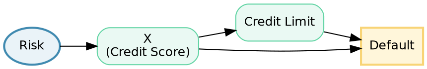

# Estimating Causal Effects
// msml610/lectures_source/Lesson08.4.txt
// msml610/lectures_source/temp/double_ML.txt
// https://github.com/gpsaggese/gpsaggese.github.io/tree/master/msml610/lectures/Lesson08.4.pdf

## Average Treatment Effect (ATE) and Conditional ATE (CATE)

// msml610/lectures_source/Lesson08.4.txt:72 "Definition"
// msml610/lectures_source/Lesson08.4.txt:273 "Individual Treatment Effect"
// msml610/lectures_source/Lesson08.4.txt:321 "Average Treatment Effects"

- In the previous chapter we discussed **identification**: determining whether a
  causal effect can be expressed in terms of observable data
  - Once a causal effect is identified, the next step is **estimation**: using
    data to compute numerical values for treatment effects
  - This chapter covers the main estimation strategies

### The Potential Outcomes Framework

// msml610/lectures_source/Lesson08.4.txt:114 "The Fundamental Problem of Causal Inference"
// msml610/lectures_source/Lesson08.4.txt:285 "Potential Outcomes"

- The **Potential Outcomes** framework (also called Rubin's framework) defines
  causal effects in terms of what would happen under different treatments
  - For each unit $i$, there are two potential outcomes:
    - $Y_{1i}$: the outcome if unit $i$ receives treatment ($T = 1$)
    - $Y_{0i}$: the outcome if unit $i$ does not receive treatment ($T = 0$)
  - In Pearl's notation: $Y_{t,i} \triangleq Y_i \mid do(T_i = t)$

- **The Fundamental Problem of Causal Inference**: you can never observe both
  potential outcomes for the same unit at the same time
  - One outcome is **factual** (observed), the other is **counterfactual**
    (theoretical, unobservable)
  - E.g., you cannot simultaneously observe what a store sells with a price cut
    and what it would have sold without one

- **Important distinction**: $Y_t = Y \mid do(T = t)$ ("what a business would
  sell if it cut prices") is different from $Y \mid T = t$ ("what a business that
  cut prices actually sold")
  - The first is a causal quantity; the second is an observational quantity

- Key assumptions for valid causal estimation:
  - **Consistency**: there is a single version of the treatment (e.g., a discount
    coupon always has the same value)
  - **No interference (SUTVA)**: the treatment of one unit does not affect the
    outcome of other units (e.g., no spillover effects)
  - **Exchangeability**: potential outcomes are independent of treatment
    assignment, $(Y_0, Y_1) \perp T$, possibly conditional on covariates

### The Individual Treatment Effect (ITE)

// msml610/lectures_source/Lesson08.4.txt:273 "Individual Treatment Effect"

- The causal effect of treatment on a single unit $i$ is:
  $$\tau_i = Y_i \mid do(T = 1) - Y_i \mid do(T = 0)$$
  - E.g., the difference in amount sold for store $i$ with versus without a price
    cut
  - The ITE cannot be directly recovered from data because we only observe one of
    the two potential outcomes

### Average Treatment Effect (ATE)

// msml610/lectures_source/Lesson08.4.txt:321 "Average Treatment Effects"

- Since individual treatment effects are unobservable, we estimate **population
  averages**

- The **Average Treatment Effect (ATE)** is the expected impact of treatment
  across the entire population:
  $$ATE = \mathbb{E}[Y_{1i} - Y_{0i}] = \mathbb{E}[Y \mid do(T = 1)] - \mathbb{E}[Y \mid do(T = 0)]$$
  - E.g., the average impact of price cuts on amount sold across all stores:
    $ATE = \mathbb{E}[AmountSold_{1i} - AmountSold_{0i}]$

### Conditional Average Treatment Effect (CATE)

// msml610/lectures_source/Lesson08.4.txt:337 "Conditional Average Treatment Effects"

- The **Conditional Average Treatment Effect (CATE)** is the expected impact of
  treatment on a subgroup defined by covariates $X = x$:
  $$CATE(x) = \mathbb{E}[(Y_{1i} - Y_{0i}) \mid X = x]$$
  - Like the ATE, but restricted to units with a specific set of characteristics
  - E.g., the impact of having sales during the week before Christmas:
    $CATE = \mathbb{E}[AmountSold_{1i} - AmountSold_{0i} \mid weeksToXmas = 0]$

- CATE is important because treatment effects are often **heterogeneous**: they
  vary across subgroups
  - A drug may work well for young patients but not for elderly ones
  - A marketing campaign may be effective for new customers but not for loyal ones

### Average Treatment Effect on the Treated (ATT)

// msml610/lectures_source/Lesson08.4.txt:351 "Average Treatment effect on the Treated"

- The **Average Treatment Effect on the Treated (ATT)** is the expected impact of
  treatment on units that actually received the treatment:
  $$ATT = \mathbb{E}[(Y_{1i} - Y_{0i}) \mid T = 1]$$
  - E.g., how much sales increase for businesses that actually engaged in price
    cuts:
    $ATT = \mathbb{E}[(AmountSold_{1i} - AmountSold_{0i}) \mid IsOnSales = 1]$

- ATT is often the most policy-relevant quantity: it answers _"did the treatment
  help the people who received it?"_
  - ATT and ATE are equal only when the treatment effect is homogeneous or when
    treatment assignment is independent of potential outcomes

### The Bias Equation

// msml610/lectures_source/Lesson08.4.txt:367 "Bias"
// msml610/lectures_source/Lesson08.4.txt:379 "The Bias Equation"

- **Bias** is what makes association different from causation
  - The claim _"cutting prices increases sales"_ can be questioned: _"those
    businesses that cut prices could probably have sold more anyway, even without
    price cuts"_

- The **bias equation** decomposes the observed difference in means:
  $$\mathbb{E}[Y \mid T = 1] - \mathbb{E}[Y \mid T = 0] = \underbrace{\mathbb{E}[Y_1 - Y_0 \mid T = 1]}_{ATT} + \underbrace{\mathbb{E}[Y_0 \mid T = 1] - \mathbb{E}[Y_0 \mid T = 0]}_{\text{Bias}}$$
  - **Association = Causation + Bias**
  - The bias term represents differences between treated and control groups
    **beyond** the treatment itself
  - E.g., treated and untreated businesses may differ in size, location, timing

- For association to equal causation, treated and control units must be
  **exchangeable**: the bias term must be zero
  - Exchangeability means $(Y_0, Y_1) \perp T$: knowing whether someone received
    treatment tells you nothing about what their outcome would have been without
    it

\begin{center}
  \includegraphics[width=0.5\textwidth]{msml610/lectures_source/figures/L08.4.Association_Causation_Bias1.png}
\end{center}

- **Simpson's Paradox** is a striking illustration of how bias distorts
  associations

// msml610/lectures_source/Lesson08.4.txt:499 "Simpson's Paradox"

  - A trend that appears in different data subgroups can reverse when the groups
    are combined
  - Classic example: a university appears to discriminate against female applicants
    (48.3% vs 67.5% overall acceptance rate), but within each department, women
    actually have higher acceptance rates
  - The paradox occurs because women disproportionately apply to harder
    departments (the confounder)

\begin{center}
  \includegraphics[width=0.5\textwidth]{msml610/lectures_source/figures/L08.4.Simpson_Paradox.png}
\end{center}

### Removing Bias Through Randomization

// msml610/lectures_source/Lesson08.4.txt:606 "Randomization Removes Bias"

- **Randomization** of treatment forces independence $(Y_0, Y_1) \perp T$,
  making the bias term vanish
  - The treatment assignment depends only on a coin flip, not on any factors
    related to the outcome
  - Under randomization, $\mathbb{E}[Y \mid T = 1] - \mathbb{E}[Y \mid T = 0] = ATE$

- When randomization is not possible, we need estimation methods that adjust for
  confounding to recover causal effects from observational data
  - The rest of this chapter covers these methods

## Matching Methods and Propensity Scores

// msml610/lectures_source/Lesson08.4.txt:1427 "Propensity score"

### The Idea Behind Matching

- **Matching** is one of the most intuitive approaches to causal effect
  estimation
  - For each treated unit, find one or more "similar" control units (or vice
    versa) based on observed covariates
  - Compare outcomes between matched pairs to estimate the treatment effect
  - _Intuition_: if two units are identical in all relevant covariates except
    treatment status, the difference in their outcomes is the treatment effect

- **Types of matching**:
  - **Exact matching**: find control units with exactly the same covariate
    values as the treated unit
    - Simple and unbiased, but often infeasible when covariates are
      high-dimensional or continuous (the curse of dimensionality)
  - **Nearest-neighbor matching**: find the $k$ closest control units based on
    a distance metric (e.g., Mahalanobis distance)
  - **Coarsened exact matching (CEM)**: coarsen covariates into bins, then
    perform exact matching on the bins
  - **Caliper matching**: match only if the distance between units falls within
    a specified threshold

- **Limitations of matching**:
  - Can only match on **observed** covariates; unobserved confounders remain
  - Quality of matches degrades as the number of covariates increases
  - May discard many unmatched units, reducing sample size

### Propensity Scores

- The **propensity score** is the probability of receiving treatment given
  observed covariates:
  $$e(X) = \Pr(T = 1 \mid X)$$

- **Rosenbaum and Rubin (1983)** showed that conditioning on the propensity
  score is sufficient to remove confounding bias, even though it reduces all
  covariates to a single number
  - If $(Y_0, Y_1) \perp T \mid X$ (conditional independence given covariates),
    then $(Y_0, Y_1) \perp T \mid e(X)$ (conditional independence given the
    propensity score)

- This is a powerful **dimensionality reduction**: instead of matching on a
  high-dimensional vector of covariates $X$, you only need to match on a single
  scalar $e(X)$

- **Propensity score estimation**: typically estimated using logistic regression
  or other classification models
  - Input: covariates $X$
  - Output: predicted probability of treatment $\hat{e}(X)$

### Propensity Score Methods

- **Propensity score matching**: match treated and control units with similar
  propensity scores
  - After matching, compute the difference in outcomes between matched pairs

- **Inverse Probability Weighting (IPW)**: reweight each observation by the
  inverse of its propensity score to create a pseudo-population where treatment
  is independent of covariates:
  $$\widehat{ATE}_{IPW} = \frac{1}{n} \sum_{i=1}^{n} \left[ \frac{T_i Y_i}{\hat{e}(X_i)} - \frac{(1 - T_i) Y_i}{1 - \hat{e}(X_i)} \right]$$
  - _Intuition_: treated units that are unlikely to be treated (low propensity
    score) get upweighted because they are more informative about what would
    happen if similar control units were treated

- **Propensity score stratification**: divide units into strata based on
  propensity score quantiles, estimate treatment effects within each stratum,
  then average across strata

- **Limitations of propensity score methods**:
  - Sensitive to misspecification of the propensity score model
  - Extreme propensity scores (near 0 or 1) lead to unstable weights in IPW
  - Still requires the assumption that all confounders are observed and measured
    correctly

## Regression Adjustment and Doubly Robust Methods

// msml610/lectures_source/Lesson08.4.txt:1086 "The Unreasonable Effectiveness of Linear Regression"
// msml610/lectures_source/Lesson08.4.txt:1205 "Adjusting with Regression"

### Regression Adjustment

- **Regression adjustment** is the simplest and most widely used approach to
  causal effect estimation from observational data
  - Model the outcome as a function of treatment and confounders:
    $$Y_i = \beta_0 + \beta_1 T_i + \sum_j \theta_j X_{ji} + \varepsilon_i$$
  - The coefficient $\hat{\beta}_1$ estimates the ATE, interpreted as the change
    in outcome for a one-unit change in treatment, holding confounders constant

- **Example: credit limits and default**

// msml610/lectures_source/Lesson08.4.txt:1088 "Banking example"

  - A bank wants to understand whether increasing credit card limits causes more
    defaults
  - Naive regression of $Default \sim CreditLimit$ yields a **negative**
    coefficient, which contradicts intuition
  - The reason: banks give higher limits to trustworthy customers (confounding)

  - Adding confounders (wage, credit scores, tenure) to the regression:
    $$Default_i = \beta_0 + \beta_1 \cdot limit_i + \sum_j \theta_j X_{ji} + \varepsilon_i$$
  - After adjustment, the credit limit coefficient becomes small and positive
    (as expected): higher limits slightly increase default risk, once we account
    for customer creditworthiness

### The Frisch-Waugh-Lovell (FWL) Theorem

// msml610/lectures_source/Lesson08.4.txt:1257 "FWL Theorem"

- The **FWL theorem** provides a powerful intuition for how regression adjustment
  works by decomposing it into three steps:

  1. **Denoising**: Regress outcome $Y$ on confounders $X$ to obtain outcome
     residuals $\tilde{Y}$ (the part of $Y$ not explained by confounders)
  2. **Debiasing**: Regress treatment $T$ on confounders $X$ to obtain treatment
     residuals $\tilde{T}$ (the part of $T$ not explained by confounders, i.e.,
     "as-if random" variation in treatment)
  3. **Effect estimation**: Regress $\tilde{Y}$ on $\tilde{T}$ to estimate the
     causal effect

- _Intuition_: FWL makes non-experimental data look as if the treatment was
  randomized
  - After partialling out confounders, the remaining variation in treatment is
    quasi-random, so we can use it to estimate the causal effect

### Backdoor Adjustment with Regression

// msml610/lectures_source/Lesson08.4.txt:977 "Backdoor Adjustment"

- The **backdoor adjustment formula** shows how conditioning on confounders
  identifies the causal effect:
  $$ATE = \mathbb{E}_X[\mathbb{E}[Y \mid T = 1, X] - \mathbb{E}[Y \mid T = 0, X]] = \sum_x (\mathbb{E}[Y \mid T = 1, X = x] - \mathbb{E}[Y \mid T = 0, X = x]) \Pr(X = x)$$
  - ATE is the weighted average of within-group treatment-vs-control differences,
    weighted by group size

- Regression provides a practical and scalable way to implement this adjustment
  - Instead of requiring exact matches on every covariate, regression models the
    relationship parametrically and extrapolates
  - This is both a strength (scalability) and a weakness (relies on functional
    form assumptions)

### Feature Selection in Causal Regression

// msml610/lectures_source/Lesson08.4.txt:1362 "Neutral Controls"

- Not all covariates should be included in a causal regression

- **Noise-reducing controls**: variables that predict the outcome well but do not
  cause the treatment
  - Including them reduces variance (tighter confidence intervals) without
    changing the estimate
  - **Strategy**: always include strong outcome predictors

- **Noise-inducing controls**: variables that predict the treatment well but do
  not predict the outcome
  - Including them reduces treatment variation and increases standard errors
  - **Strategy**: avoid including strong treatment predictors that do not predict
    the outcome

- **The trade-off**: $MSE = Bias^2 + Variance$
  - Including all confounders eliminates bias but may increase variance
  - In practice, it is often worth accepting a small amount of bias for a large
    reduction in variance

### Doubly Robust Estimation

- **Doubly robust (DR) estimators** combine regression adjustment and propensity
  score weighting to provide extra protection against model misspecification

- The doubly robust ATE estimator is:
  $$\widehat{ATE}_{DR} = \frac{1}{n} \sum_{i=1}^{n} \left[ \hat{\mu}_1(X_i) - \hat{\mu}_0(X_i) + \frac{T_i (Y_i - \hat{\mu}_1(X_i))}{\hat{e}(X_i)} - \frac{(1 - T_i)(Y_i - \hat{\mu}_0(X_i))}{1 - \hat{e}(X_i)} \right]$$
  where $\hat{\mu}_t(X)$ is the estimated outcome model under treatment $t$ and
  $\hat{e}(X)$ is the estimated propensity score

- **Double robustness property**: the estimator is consistent if **either** the
  outcome model or the propensity score model is correctly specified (but not
  necessarily both)
  - This provides a "second chance" against misspecification
  - If both models are correct, the estimator achieves the semiparametric
    efficiency bound (lowest possible variance)

- **Augmented Inverse Probability Weighting (AIPW)** is the most common doubly
  robust estimator and is used as the default in many modern causal inference
  libraries

### Double Machine Learning (DML)

- **Double Machine Learning** (Chernozhukov et al., 2018) extends the FWL
  approach by replacing linear regression with flexible ML models

- The procedure:
  1. Use ML to predict $Y$ from $X$ (denoising): obtain residuals $\tilde{Y}$
  2. Use ML to predict $T$ from $X$ (debiasing): obtain residuals $\tilde{T}$
  3. Regress $\tilde{Y}$ on $\tilde{T}$ to estimate the causal effect

- **Key innovation**: uses **cross-fitting** (sample splitting) to avoid
  overfitting bias
  - Split data into $K$ folds; train ML models on $K-1$ folds and predict on the
    held-out fold
  - This ensures that the nuisance parameter estimates (steps 1 and 2) are
    independent of the causal estimation (step 3)

- DML combines the flexibility of ML with the rigor of causal inference
  - Works with any ML model (random forests, gradient boosting, neural networks)
  - Produces valid confidence intervals and hypothesis tests
  - Particularly useful when the confounding structure is complex or
    high-dimensional

## Uplift Modeling and Heterogeneous Treatment Effects

// msml610/lectures_source/Lesson08.4.txt:337 "Conditional Average Treatment Effects"

- The ATE gives a single number for the entire population, but in practice
  treatment effects often **vary** across individuals
  - A marketing email may convert price-sensitive customers but annoy loyal ones
  - A medical treatment may benefit young patients but harm elderly ones
  - Understanding this heterogeneity is critical for targeting interventions

### Meta-Learners for CATE Estimation

// msml610/lectures_source/Lesson08.4.txt:1434 "Metalerners"

- **Meta-learners** are frameworks that use off-the-shelf ML models to estimate
  heterogeneous treatment effects (CATE)

- **S-Learner (Single model)**:
  - Train a single model to predict outcome $Y$ from covariates $X$ and
    treatment $T$: $\hat{\mu}(X, T)$
  - Estimate CATE as: $\hat{\tau}(x) = \hat{\mu}(x, 1) - \hat{\mu}(x, 0)$
  - Simple but may underestimate treatment effects if the model "shrinks" the
    treatment indicator

- **T-Learner (Two models)**:
  - Train separate outcome models for treated and control:
    $\hat{\mu}_1(X)$ and $\hat{\mu}_0(X)$
  - Estimate CATE as: $\hat{\tau}(x) = \hat{\mu}_1(x) - \hat{\mu}_0(x)$
  - More flexible but requires sufficient data in both treatment groups

- **X-Learner**:
  - Stage 1: fit T-Learner models $\hat{\mu}_0$ and $\hat{\mu}_1$
  - Stage 2: impute treatment effects using cross-predictions:
    - For treated units: $\tilde{\tau}_1 = Y_i - \hat{\mu}_0(X_i)$
    - For control units: $\tilde{\tau}_0 = \hat{\mu}_1(X_i) - Y_i$
  - Stage 3: fit models to predict imputed effects as a function of $X$
  - Stage 4: combine predictions weighted by propensity scores
  - Works well when treatment and control groups are very different in size

- **R-Learner (Robinson decomposition)**:
  - Based on the FWL/Robinson decomposition:
    $Y - \mathbb{E}[Y \mid X] = \tau(X)(T - e(X)) + \varepsilon$
  - Directly estimates $\tau(X)$ by minimizing a modified loss function
  - Strong theoretical properties and works well with regularized ML models

### Causal Forests

- **Causal forests** (Athey and Imbens, 2018) extend random forests to estimate
  heterogeneous treatment effects

- Key idea: instead of splitting on variance of $Y$, split on heterogeneity of
  treatment effects
  - Each leaf of the tree estimates a local treatment effect for the units that
    fall into that leaf
  - The forest averages over many trees to produce smooth CATE estimates

- **Honest estimation**: the data used to determine the tree structure is
  different from the data used to estimate treatment effects within leaves
  - This avoids overfitting and enables valid confidence intervals

- Causal forests provide:
  - Point estimates of $\tau(x)$ for any covariate vector $x$
  - Valid confidence intervals for individual treatment effects
  - Variable importance measures that indicate which covariates drive treatment
    effect heterogeneity

### Uplift Modeling

- **Uplift modeling** (also called **incremental modeling** or **net modeling**)
  is the applied practice of estimating heterogeneous treatment effects,
  particularly in marketing and customer management

- The goal is to identify individuals who would respond positively to treatment
  and target them, while avoiding:
  - **Sure things**: people who would convert regardless of treatment
  - **Lost causes**: people who would not convert regardless of treatment
  - **Sleeping dogs**: people who would convert without treatment but not with it
    (negative treatment effect)

- **The four segments** (based on CATE):
  - **Persuadables** ($\tau(x) > 0$): treatment has a positive effect; target
    these
  - **Sure things** ($Y_1 \approx Y_0 \approx 1$): no treatment effect needed
  - **Lost causes** ($Y_1 \approx Y_0 \approx 0$): treatment has no effect
  - **Sleeping dogs** ($\tau(x) < 0$): treatment has a negative effect; avoid
    these

- **Evaluation of uplift models**:
  - **Uplift curve**: analogous to the ROC curve but for treatment effects
  - **Qini coefficient**: area between the uplift curve and the random targeting
    line (analogous to AUC)
  - Standard prediction metrics (accuracy, F1) are not appropriate because the
    ground truth (individual treatment effects) is never observed

## Application: Healthcare Observational Studies and Treatment Effect Estimation

- Healthcare is one of the most important and challenging domains for causal
  effect estimation
  - RCTs are the gold standard for evaluating medical treatments, but they are
    often expensive, slow, or ethically impossible
  - Observational studies using electronic health records, insurance claims, and
    registries are increasingly used as alternatives

- **Key challenges in healthcare observational studies**:
  - **Confounding by indication**: patients who receive a treatment are often
    sicker (or healthier) than those who do not, because treatment decisions are
    based on clinical factors
  - **Time-varying confounding**: covariates that change over time (e.g., blood
    pressure readings) can be both confounders and mediators
  - **Immortal time bias**: patients in the treatment group may appear to have
    better outcomes simply because they survived long enough to receive treatment
  - **Measurement error**: clinical variables are measured with noise, and some
    confounders may not be recorded in administrative data

- **Example: estimating the effect of a new drug from electronic health records**
  - Suppose a hospital wants to know whether a new cholesterol-lowering drug
    reduces the risk of heart attack compared to an existing drug
  - Patients were not randomly assigned to the new vs. old drug; doctors chose
    based on patient characteristics
  - Using propensity score matching: estimate the probability of receiving the
    new drug based on age, sex, BMI, smoking status, comorbidities, and prior
    medications; match treated patients to control patients with similar
    propensity scores; compare heart attack rates between matched groups
  - Using doubly robust estimation: fit both an outcome model (risk of heart
    attack given covariates and treatment) and a propensity score model; combine
    them using the AIPW estimator for extra protection against misspecification

- **Best practices for healthcare causal inference**:
  - Pre-register the analysis plan (specify covariates, estimand, and method
    before looking at outcomes)
  - Conduct sensitivity analysis to assess robustness to unmeasured confounding
  - Report both ATE and CATE (heterogeneous effects across patient subgroups)
  - Use active comparators (compare drug A vs. drug B, not drug A vs. no
    treatment) to reduce confounding by indication
  - Validate results against available RCT evidence where possible

## TUTORIAL: EconML (double ML, Causal Forests, and Meta-learners for ATE/CATE Estimation)

## TUTORIAL: CausalML (propensity Scoring, Matching, and Uplift Estimation)

**References**

- Matheus Facure, _Causal Inference in Python: Applying Causal Inference in the
  Tech Industry_ (2023) - practical guide to ATE, CATE, regression adjustment,
  propensity scores, and meta-learners in Python
- Guido Imbens and Donald Rubin, _Causal Inference for Statistics, Social, and
  Biomedical Sciences_ (2015) - rigorous treatment of the potential outcomes
  framework, matching, and propensity scores
- Paul Rosenbaum and Donald Rubin, "The Central Role of the Propensity Score in
  Observational Studies for Causal Effects" (1983) - foundational paper on
  propensity scores
- Victor Chernozhukov, Denis Chetverikov, Mert Demirer, Esther Duflo, Christian
  Hansen, Whitney Newey, and James Robins, "Double/Debiased Machine Learning for
  Treatment and Structural Parameters" (2018) - the Double ML paper
- Susan Athey and Guido Imbens, "Estimation and Inference of Heterogeneous
  Treatment Effects using Random Forests" (2018) - causal forests
- Scott Cunningham, _Causal Inference: The Mixtape_ (2021) - accessible treatment
  of matching, regression adjustment, and propensity scores
- Stefan Wager and Susan Athey, "Estimation and Inference of Heterogeneous
  Treatment Effects using Random Forests" (2018) - generalized random forests
- Soren Kunzel, Jasjeet Sekhon, Peter Bickel, and Bin Yu, "Metalearners for
  Estimating Heterogeneous Treatment Effects using Machine Learning" (2019) -
  S-learner, T-learner, X-learner
- Xinkun Nie and Stefan Wager, "Quasi-Oracle Estimation of Heterogeneous
  Treatment Effects" (2021) - R-learner
- Miguel Hernan and James Robins, _Causal Inference: What If_ (2020) - inverse
  probability weighting, doubly robust estimation, and time-varying treatments
- Peng Ding, _A First Course in Causal Inference_ (2024) - modern textbook
  covering the potential outcomes framework and estimation methods
- EconML documentation: https://econml.azurewebsites.net/ - Microsoft's library
  for heterogeneous treatment effect estimation
- CausalML documentation: https://causalml.readthedocs.io/ - Uber's library for
  uplift modeling and causal inference
