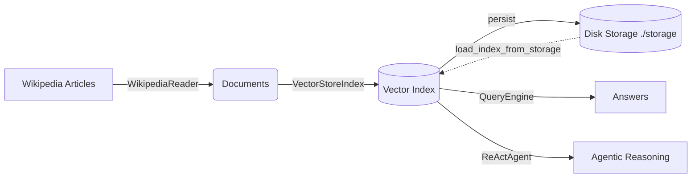

<!-- toc -->

- [Introduction](#introduction)
- [What this notebook builds](#what-this-notebook-builds)
- [Pipeline architecture](#pipeline-architecture)
- [Setup and prerequisites](#setup-and-prerequisites)
- [Notebook walkthrough](#notebook-walkthrough)
  * [1. Data ingestion (WikipediaReader)](#1-data-ingestion-wikipediareader)
  * [2. Index creation + persistence](#2-index-creation--persistence)
  * [3. Queries](#3-queries)
  * [4. Evaluation (faithfulness)](#4-evaluation-faithfulness)
  * [5. Visualization (timeline)](#5-visualization-timeline)
  * [6. Model comparison (llama3 vs mistral)](#6-model-comparison-llama3-vs-mistral)
  * [7. ReAct agent (tools + reasoning)](#7-react-agent-tools--reasoning)
- [How to run](#how-to-run)
- [Outputs and files created](#outputs-and-files-created)
- [Using the Streamlit app](#using-the-streamlit-app)
- [Troubleshooting](#troubleshooting)

<!-- tocstop -->

## Introduction

`llamaindex.example.ipynb` is the **end-to-end project notebook**. It builds a
historical question-answering system over Wikipedia articles using LlamaIndex
and fully local LLMs via Ollama.

This notebook applies the concepts from `llamaindex.API.ipynb` to a real dataset
and extends the pipeline with:

- persistent index storage (`./storage`)
- evaluation (LLM-as-a-judge faithfulness)
- visualization (knowledge base coverage timeline)
- local model comparison (`llama3` vs `mistral`)
- an autonomous ReAct agent with multiple tools

## What this notebook builds

- A RAG pipeline over a **curated Wikipedia corpus (~10 historical event pages)**, including:
  - World War II, World War I
  - French Revolution, Industrial Revolution, American Civil War
  - Cold War, Space Race
  - Renaissance, Roman Empire, Age of Discovery
- A persisted vector index that can be re-used without re-embedding on later runs
- A ReAct agent that can combine:
  - factual lookups (querying the index)
  - arithmetic (years-between calculation)

## Pipeline architecture



## Setup and prerequisites

- **Ollama installed on the host** and running
- **Models pulled locally**:

```bash
ollama pull llama3
ollama pull mistral
```

- **Network access is required for ingestion** (Wikipedia fetch) on the first run
  (or whenever you delete `./storage`).
- **Run inside Docker** (recommended/required for reproducibility in this repo):

```bash
./docker_build.sh
./docker_jupyter.sh
```

## Notebook walkthrough

### 1. Data ingestion (WikipediaReader)

- Uses `WikipediaReader` (`llama-index-readers-wikipedia`) to fetch full articles.
- Uses:
  - `auto_suggest=False` to avoid unintended page redirects
  - `wikipedia.set_user_agent(...)` to reduce API request failures

### 2. Index creation + persistence

- Builds a `VectorStoreIndex` from the ingested documents.
- Persists index state to `./storage` so later runs can load instantly via
  `StorageContext` + `load_index_from_storage`.

### 3. Queries

- Runs several targeted historical queries against the same index.

### 4. Evaluation (faithfulness)

- Uses `FaithfulnessEvaluator` (LLM-as-a-judge) to check whether answers are
  grounded in retrieved context.

### 5. Visualization (timeline)

- Produces a timeline chart (`historical_events_timeline.png`) showing the date
  ranges of the (curated) historical events in the knowledge base.

### 6. Model comparison (llama3 vs mistral)

- Demonstrates LlamaIndex’s model-agnostic design: the **index stays fixed**
  (embeddings unchanged) while only the LLM is swapped for synthesis.

### 7. ReAct agent (tools + reasoning)

- Creates a ReAct agent with two tools:
  - `wikipedia_history_db` (a `QueryEngineTool` wrapping the index)
  - `subtract_years` (a `FunctionTool` for arithmetic)
- Runs a multi-part prompt requiring both tools.

## How to run

- Run the notebook top-to-bottom:
  - `llamaindex.example.ipynb`
- Optional: run the script version:

```bash
python llamaindex.example.py
```

## Outputs and files created

- **`./storage/`**: persisted index state (created on first successful run)
- **`historical_events_timeline.png`**: timeline visualization saved by the notebook

## Using the Streamlit app

This repo includes `app.py`, a Streamlit chat UI that loads the persisted index
from `./storage` and uses a ReAct agent for responses.

- Build the image and run Streamlit:

```bash
./docker_build.sh
./docker_streamlit.sh
```

Then open Streamlit (typically `http://127.0.0.1:8501`).

Note: The app requires `./storage` to exist. If you see “Vector Index not found”,
run `llamaindex.example.ipynb` first to generate `./storage`.

## Troubleshooting

- **Wikipedia ingestion failures**:
  - Ensure the environment has network access
  - Keep `auto_suggest=False` and the `set_user_agent(...)` line enabled
- **Ollama connection errors**:
  - Ensure Ollama is running on the host
  - Container connects via `http://host.docker.internal:11434`