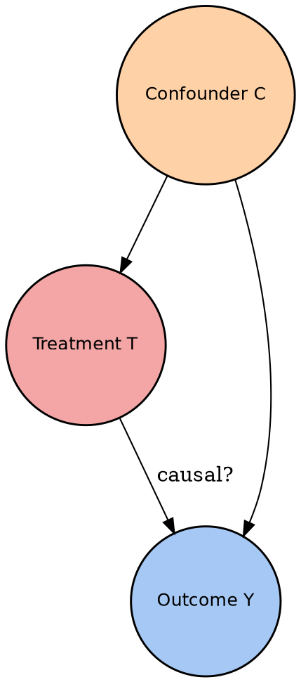
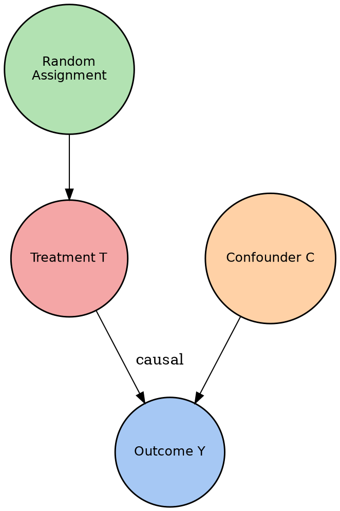
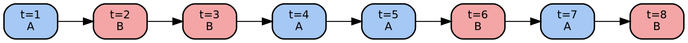
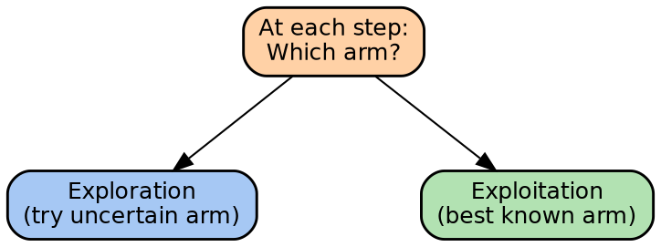

// TODO: Improve the bold

::: columns
:::: {.column width=15%}

::::
:::: {.column width=75%}

\vspace{0.4cm}
\begingroup \large
MSML610: Advanced Machine Learning
\endgroup
::::
:::

\vspace{1cm}

\begingroup \Large
**$$\text{\blue{Lesson 09: A/B Testing and Experimentation}}$$**
\endgroup
\vspace{1cm}

::: columns
:::: {.column width=65%}
**Instructor**: Dr. GP Saggese, [gsaggese@umd.edu](gsaggese@umd.edu)

**References**:

- Pearl, Glymour, Jewell: _"Causal Inference in Statistics: A Primer"_ (2016)

- Kohavi, Tang, Xu: _"Trustworthy Online Controlled Experiments"_ (2020)

- Sutton, Barto: _"Reinforcement Learning: An Introduction"_ (2018)

::::
:::: {.column width=40%}

{ height=20% }

::::
:::

# ##############################################################################
# Introduction and Motivation
# ##############################################################################

* Why A/B Testing Matters

- Every day, companies ship changes that move billions of dollars
  - New checkout button color, new ranking model, new pricing rule
  - _Question_: Did the change **cause** the observed shift in revenue?

- Observational data alone cannot answer this
  - Users who saw version B may differ from users who saw version A
  - Seasonality, selection, and confounders distort naive comparisons

- **A/B testing** is the workhorse of practical causal inference
  - Randomly assign users to **treatment** or **control**
  - Compare average outcomes to estimate a causal effect
  - Gold standard when feasible

- **Example**: Google reports running >10,000 experiments per year to validate
  ranking changes before launch

# ##############################################################################
# Randomization as Causal Identification
# ##############################################################################

// TODO(gp): Repeated with Lesson08.4

## #############################################################################
## Why Randomization Breaks Confounding
## #############################################################################

* The Core Problem: Confounding

- In observational data, treatment $T$ and outcome $Y$ often share a common
  cause $C$ (confounder)

- Naive comparison $\EE[Y | T=1] - \EE[Y | T=0]$ mixes:
  - The true causal effect of $T$ on $Y$
  - Differences in $C$ between treated and untreated groups

- **Example**: Patients who take vitamin D (T) have lower heart disease (Y)
  - But _healthier_ patients tend to take vitamins (C = health consciousness)
  - Is vitamin D causal or just a proxy for healthy habits?

- _Goal of randomization_: force $T$ to be independent of $C$

* Randomization: Causal Identification from Design

- **Randomized Controlled Trial (RCT)**: assign each unit $i$ a treatment
  $T_i \in \{0, 1\}$ via coin flip, independent of all covariates

- Key property: $T \perp C$ for every potential confounder $C$
  - No selection bias
  - No reverse causation

- Under randomization, the observed difference equals the causal effect:
  $$
  \EE[Y | T=1] - \EE[Y | T=0] = \EE[Y^{1} - Y^{0}] \defeq \text{ATE}
  $$
  where $Y^{1}, Y^{0}$ are potential outcomes

- **No back-door adjustment needed** — the design closes all back-door paths

// TODO(gp): Merge the graphs in the same slide
* Causal Graph of an Observational Study

- Estimating $T \to Y$ requires adjusting for $C$
- If $C$ is unobserved, the effect is **not identifiable**

* Causal Graph of a Randomized Experiment

- Randomization **severs** the $C \to T$ arrow
- $T$ has only one parent: the coin flip $R$
- Association between $T$ and $Y$ is purely causal

* Do-Operator View of Randomization

- Recall Pearl's do-operator: $\Pr(Y | do(T=t))$ is the distribution of $Y$
  when we _intervene_ to set $T = t$

- In a graph, $do(T=t)$ removes all incoming arrows to $T$

- **Randomization implements $do(T=t)$ physically**
  - The coin flip replaces all natural causes of $T$
  - Hence $\Pr(Y | T=t) = \Pr(Y | do(T=t))$ in an RCT

- **Key insight**: The identification problem disappears because the data
  come from the **intervention distribution**, not the observational one

## #############################################################################
## Potential Outcomes and ATE
## #############################################################################

* Potential Outcomes Framework

- For each unit $i$, define two **potential outcomes**:
  - $Y_i^{1}$: outcome if treated
  - $Y_i^{0}$: outcome if untreated

- We observe only one of them:
  $$
  Y_i = T_i \cdot Y_i^{1} + (1 - T_i) \cdot Y_i^{0}
  $$

- This is the **Fundamental Problem of Causal Inference** (Holland, 1986)
  - Individual treatment effect $Y_i^{1} - Y_i^{0}$ is never observable

- But the **average** is estimable under randomization:
  $$
  \text{ATE} = \EE[Y^{1} - Y^{0}] = \EE[Y^{1}] - \EE[Y^{0}]
  $$

* The Difference-in-Means Estimator

- Under randomization $T \perp (Y^{0}, Y^{1})$:
  - $\EE[Y | T=1] = \EE[Y^{1} | T=1] = \EE[Y^{1}]$
  - $\EE[Y | T=0] = \EE[Y^{0} | T=0] = \EE[Y^{0}]$

- The **difference-in-means** estimator:
  $$
  \widehat{\text{ATE}} = \frac{1}{n_1} \sum_{i: T_i=1} Y_i - \frac{1}{n_0} \sum_{i: T_i=0} Y_i
  $$

- Properties:
  - Unbiased: $\EE[\widehat{\text{ATE}}] = \text{ATE}$
  - Consistent: converges to ATE as $n \to \infty$
  - Variance: $\VV[\widehat{\text{ATE}}] = \sigma_1^2/n_1 + \sigma_0^2/n_0$

* SUTVA: The Silent Assumption

- **Stable Unit Treatment Value Assumption (SUTVA)**:
  1. _No interference_: unit $i$'s outcome depends only on unit $i$'s treatment
  2. _No hidden variation_: one "version" of treatment per arm

- **Example** of SUTVA violation (network effects):
  - Treatment: show new feature to half of Facebook users
  - A treated user's posts reach untreated friends
  - Control is "contaminated" $\to$ ATE estimate is biased

- SUTVA is the _Achilles heel_ of online experimentation
  - Two-sided marketplaces (Uber, Airbnb) routinely violate it
  - We will revisit with **switchback experiments**

# ##############################################################################
# A/B Testing in Practice
# ##############################################################################

## #############################################################################
## Classic A/B Test Design
## #############################################################################

* Anatomy of a Classic A/B Test

- **Example**: Evaluate a new checkout button color
  1. Define **primary metric**: conversion rate (purchase / visit)
  2. Specify **null hypothesis**: $H_0: \mu_A = \mu_B$
  3. Choose **significance level** $\alpha$ (typically 0.05)
  4. Choose **power** $1 - \beta$ (typically 0.80)
  5. Compute required **sample size** $n$
  6. Randomly assign each visitor to A or B
  7. Collect data for the pre-specified duration
  8. Compute test statistic, make decision

- Each step has **statistical** and **business** consequences

* Hypothesis Testing Refresher

- **Two-sample z-test** for difference in proportions:
  $$
  Z = \frac{\hat{p}_B - \hat{p}_A}{\sqrt{\hat{p}(1-\hat{p})\left(\frac{1}{n_A} + \frac{1}{n_B}\right)}}
  $$

- Reject $H_0$ if $|Z| > z_{1 - \alpha/2}$

- Types of error:
  - **Type I error** ($\alpha$): false positive (ship a change that does nothing)
  - **Type II error** ($\beta$): false negative (miss a real improvement)

- **Q**: Which error is worse for a startup vs. a bank?

## #############################################################################
## Power Analysis and Sample Size
## #############################################################################

* Power Analysis: The Key Formula

- **Power** $1 - \beta$ = probability of detecting a true effect of size $\delta$

- For two-sample test with equal arms:
  $$
  n \approx \frac{2 \sigma^2 (z_{1-\alpha/2} + z_{1-\beta})^2}{\delta^2}
  $$

- Key drivers:
  - **Variance** $\sigma^2$: noisier metric $\to$ larger $n$
  - **Effect size** $\delta$: smaller effect $\to$ **quadratically** larger $n$
  - **Confidence** ($\alpha, \beta$): stricter $\to$ larger $n$

- **Example**: Halving the detectable effect **quadruples** required users

// TODO(gp): Move to notebook. Is there a Python package for this?
* Power Analysis: Worked Example

- **Example**: Test a checkout redesign
  - Baseline conversion: $p_A = 0.10$
  - Minimum detectable effect (MDE): $\delta = 0.005$ (0.5 percentage point)
  - $\alpha = 0.05$, $\beta = 0.20$

- Plug in:
  $$
  n \approx \frac{2 \cdot (0.10 \cdot 0.90) \cdot (1.96 + 0.84)^2}{(0.005)^2} \approx 56{,}400 \text{ per arm}
  $$

- **Interpretation**:
  - Need ~113K users total
  - If site has 10K daily visits, experiment runs ~12 days
  - Running shorter **under-powers** the test and wastes the effort

* Minimum Detectable Effect (MDE)

- **MDE** is the smallest effect the experiment can detect with target power

- Flip the formula:
  $$
  \text{MDE} \approx (z_{1-\alpha/2} + z_{1-\beta}) \sqrt{\frac{2 \sigma^2}{n}}
  $$

- Useful at planning time:
  - Given traffic budget, what's the smallest effect we could catch?
  - If MDE $>$ business-relevant threshold, the test is not worth running

- **Pro tip**: Always compute MDE _before_ running the test, not after
  - Avoids the seductive "we'll just look at the data" mindset

## #############################################################################
## Common A/B Testing Pitfalls
## #############################################################################

* Peeking and the Multiple Comparisons Trap

- **Peeking**: checking the test repeatedly and stopping when $p < 0.05$
  - _Problem_: each check is a new chance to commit Type I error
  - True false-positive rate can exceed 30%

- **Solutions**:
  - _Pre-commit_ to a sample size and a single analysis
  - Use **sequential tests** (SPRT, mSPRT, always-valid inference)
  - Apply **Bonferroni** or **Benjamini-Hochberg** when testing many metrics

- **Example**: Testing 20 secondary metrics at $\alpha = 0.05$ gives
  $1 - 0.95^{20} \approx 64\%$ chance of at least one false positive

* Sample Ratio Mismatch (SRM)

- **SRM**: observed traffic split differs significantly from intended (e.g.,
  50/50 split turns out 48/52)

- Often indicates a **bug**:
  - Cookies not sticky; bot traffic routed to one arm
  - Telemetry dropping in one arm only
  - Opt-outs correlated with treatment

- **Diagnosis**: chi-square test on assignment counts
  - If $p < 0.001$, _do not trust the experiment_

- **Rule**: SRM invalidates the randomization assumption $\to$
  the ATE estimate is no longer unbiased

* Novelty and Primacy Effects

- **Novelty**: users react to "new" stimulus, effect fades
  - New button gets more clicks the first week, then reverts

- **Primacy**: users resist change, effect grows
  - Power users initially confused, adapt over time

- Both produce **time-varying treatment effects**

- **Mitigations**:
  - Run experiments long enough to capture steady-state
  - Analyze by user tenure cohort (new vs. returning)
  - Segment by exposure count (first-time vs. repeated exposure)

* Cannibalization and Interference

- Treatment may help its arm by **stealing** from another:
  - Showing discounts only to group A cannibalizes group B purchases
  - SUTVA violated: control is no longer a clean counterfactual

- **Symptoms**:
  - Treatment lift on the primary metric, but total company metric flat
  - Downstream teams see unexplained regressions

- **Fixes**:
  - **Cluster-level randomization** (by city, marketplace, social group)
  - **Switchback experiments** (next section)

# ##############################################################################
# Advanced Experimental Designs
# ##############################################################################

## #############################################################################
## Switchback Experiments
## #############################################################################

* Why Switchbacks? The Marketplace Problem

- Two-sided marketplaces (Uber, Lyft, DoorDash) share **supply**
  - If A gets better driver matching, B gets worse matching automatically
  - User-level randomization violates SUTVA

- _Idea_: randomize **time periods**, not users
  - At time $t$, entire city runs in treatment or control
  - Alternate every $\Delta$ minutes (e.g., 30 min)

- **Switchback experiment**: the whole system switches between A and B
  over contiguous time windows

* Switchback Design: Schematic

- Whole region alternates between A and B over time
- Same users experience both arms $\to$ paired comparison

* Switchback: Pros and Cons

- **Pros**
  - Captures **total** marketplace effect (no supply spillover)
  - Works when user randomization is impossible
  - Natural for pricing, matching, surge algorithms

- **Cons**
  - **Temporal correlation**: adjacent windows are not independent
    - Standard errors must be corrected (e.g., block-bootstrap)
  - **Carryover effects**: decisions at $t-1$ affect state at $t$
  - Fewer effective "units" $\to$ lower statistical power
  - Day-of-week and hour-of-day confounds must be balanced

- _Rule of thumb_: use switchback when SUTVA is clearly violated; otherwise
  prefer user-level A/B

## #############################################################################
## Multi-Armed Bandits
## #############################################################################

* From A/B to Multi-Armed Bandits

- Classic A/B test: 50/50 split, _wait_, analyze
  - Every visitor during the test contributes equally to learning
  - Even after B looks clearly worse, we keep showing it

- **Multi-armed bandit (MAB)**: adaptively shift traffic to better arms
  - Exploits the **exploration–exploitation** tradeoff
  - Less regret (lost reward) while learning
  - Useful when many arms or continuous optimization

- **Example**: News site picking headlines — classic MAB territory

* Exploration vs. Exploitation

- **Exploration**: try arms whose value is uncertain
  - Gathers information, reduces future regret
- **Exploitation**: choose the arm with highest estimated value
  - Captures known reward _now_

- Pure exploration = classic A/B; pure exploitation = greedy, locks into
  suboptimal arm

* Epsilon-Greedy Algorithm

- Simplest bandit strategy:
  1. With prob. $\varepsilon$: pick a **random** arm (explore)
  2. With prob. $1 - \varepsilon$: pick the **best empirical** arm (exploit)

- Typical $\varepsilon \in [0.05, 0.2]$
  - Decay over time: $\varepsilon_t \propto 1/t$

- **Pros**: trivially simple, works surprisingly well
- **Cons**: wastes exploration on clearly bad arms; ignores uncertainty

* Upper Confidence Bound (UCB)

- Choose the arm that maximizes an **optimism index**:
  $$
  a_t = \arg\max_i \left[ \hat{\mu}_i + \sqrt{\frac{2 \log t}{n_i}} \right]
  $$
  - $\hat{\mu}_i$: empirical mean reward of arm $i$
  - $n_i$: times arm $i$ has been pulled

- _Idea_: be **optimistic** about uncertain arms
  - Less-sampled arms get a confidence bonus
  - Over time bonus shrinks $\to$ converges to best arm

- Regret: $O(\log T)$ — provably optimal scaling

* Thompson Sampling

- **Bayesian** approach:
  1. Maintain posterior over each arm's reward, $\pi_i(\theta)$
  2. Sample $\theta_i \sim \pi_i$ for each arm
  3. Pull arm $\arg\max_i \theta_i$
  4. Update posterior with observed reward

- For Bernoulli rewards: Beta-Binomial conjugate pair
  - Each arm has $\text{Beta}(\alpha_i, \beta_i)$ posterior
  - Update: $\alpha_i \mathrel{+}= \text{success}$, $\beta_i \mathrel{+}= \text{failure}$

- **Pros**: natural uncertainty, easy to extend, empirically very strong
- Used in: online ads, recommendation systems, clinical trials

* Contextual Bandits

- Standard bandit: reward depends only on arm
- **Contextual bandit**: reward depends on arm _and_ context $x$ (user features)

- Learn a policy $\pi(x) \to a$ that maximizes expected reward
  - LinUCB, Thompson Sampling with linear models, neural bandits

- **Example**: personalized news
  - Context: user's prior clicks, time of day, device
  - Arms: candidate articles
  - Reward: click (0/1)

- This connects bandits to **uplift modeling** (Ch. 6) and **policy learning**
  (Ch. 11)

## #############################################################################
## Limits of Standard A/B Testing
## #############################################################################

* When A/B Testing Is Not Enough

- **Small effects, massive samples**: not every question has a 10% lift
  - Ranking changes often move metrics by 0.1%
  - Power budget may be infeasible

- **Long-horizon effects**:
  - Retention, LTV, churn show up over months
  - Experiments rarely run that long

- **Heterogeneous effects**:
  - Average treatment effect hides which users benefit
  - Need **CATE** methods (causal forests, meta-learners, see Ch. 6)

- **Ethical and legal constraints**:
  - Can't randomize medical treatments when one is known better
  - Can't deny service to control group in many regulated industries

* Network Effects and Interference

- Social networks, marketplaces, and platforms violate SUTVA routinely

- **Mitigations**:
  - _Cluster randomization_: treat entire cities, schools, or social clusters
  - _Ego-network designs_: treat a user and all their neighbors together
  - _Graph cluster randomization_: partition the graph into near-independent
    components

- _Example_: Facebook's News Feed tests cluster by geography and
  "friends-of-friends" to limit contamination

- Often complemented with **structural causal models** that explicitly model
  the spillover mechanism

# ##############################################################################
# When to Experiment vs. Observe
# ##############################################################################

* Decision Framework: Experiment or Observe?

| **Criterion**       | **Experiment**     | **Observational**       |
| :------------------ | :----------------- | :---------------------- |
| Randomization       | Feasible           | Not feasible            |
| Ethics              | Treatments equipoise | Known-better exists   |
| Cost / time         | Acceptable         | Prohibitive             |
| Treatment control   | We control it      | Already happened        |
| Confounding         | Design removes it  | Must adjust explicitly  |
| External validity   | In-sample only     | Population-wide         |

- Ask first: _"Can I randomize, ethically and affordably?"_
  - Yes $\to$ run a controlled experiment
  - No $\to$ reach for observational causal methods

* Feasibility Constraints on Experiments

- **Cost**: running a fleet-wide test on a logistics system may burn millions
- **Time**: detecting LTV changes may require multi-year follow-up
- **Sample scarcity**: rare diseases, enterprise customers, B2B
- **Legal / regulatory**: pricing discrimination rules, data-use restrictions
- **Ethics**: withholding beneficial treatments is often impermissible

- **Example**: effect of maternal smoking on infant birthweight
  - Cannot randomize mothers to smoke
  - Must use **natural experiments** or **IV** (see Ch. 6)

* Hybrid Approaches: Experiments + Causal Methods

- Best of both worlds when possible:

- **Stratified experiments**: randomize _within_ observational strata
  - Improves power and captures heterogeneity

- **Doubly robust estimation on RCT data**
  - Combine randomization with outcome regression
  - Robust to misspecification in either component

- **Experiment + causal forest**: estimate CATE from randomized data
  - Find _where_ the effect is largest

- **Transportability**: use an RCT in one site to inform observational
  analysis in another (Pearl & Bareinboim, 2014)

* Policy Evaluation and Off-Policy Learning

- Often we want to evaluate a **new policy** $\pi_{\text{new}}$ before deploying

- **Off-policy evaluation (OPE)**:
  - Use logged data from old policy $\pi_{\text{old}}$
  - Estimate $\EE_{\pi_{\text{new}}}[R]$ without deploying

- Core tool: **inverse propensity score (IPS)** weighting
  $$
  \hat{V}(\pi_{\text{new}}) = \frac{1}{n} \sum_i \frac{\pi_{\text{new}}(a_i | x_i)}{\pi_{\text{old}}(a_i | x_i)} r_i
  $$

- Bridges classic A/B testing with **causal reinforcement learning** (Ch. 12)

* Case Study: Marketing Campaign Uplift

- **Problem**: send a promotional email to maximize incremental revenue

- Naive approach: target users likely to purchase
  - But many would purchase anyway $\to$ wasted effort

- **Uplift-based approach**:
  1. Run small randomized pilot (email vs. hold-out)
  2. Fit a **CATE** model (S/T/X-learner) on pilot data
  3. Rank users by estimated individual uplift
  4. Deploy full campaign to top-$k$ users
  5. Hold out a control slice to validate incremental lift

- Turns a predictive-ranking problem into a **causal** one
