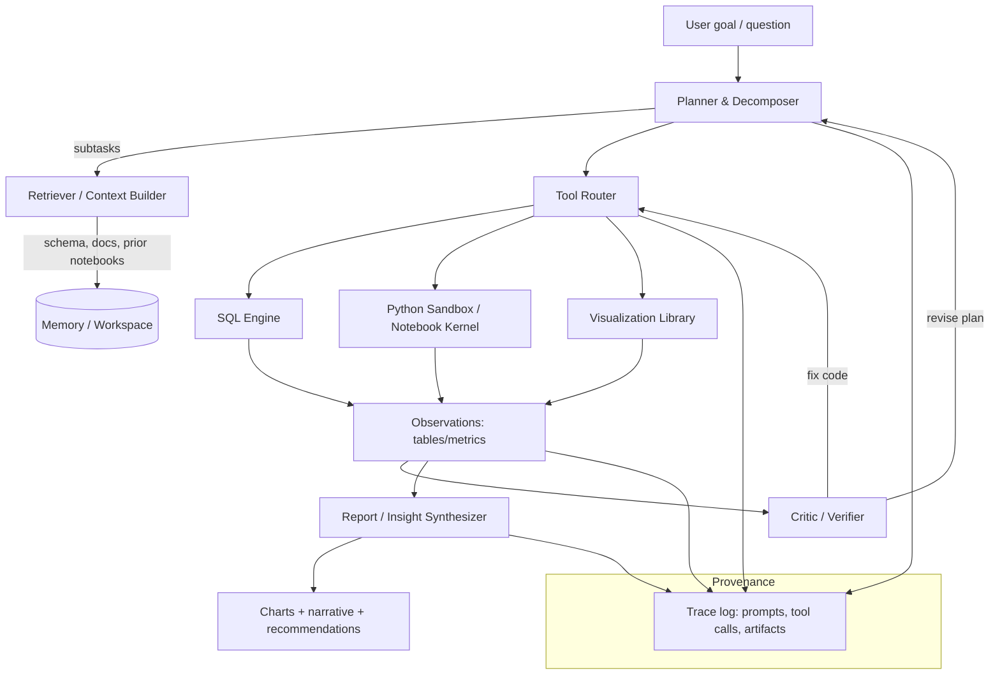
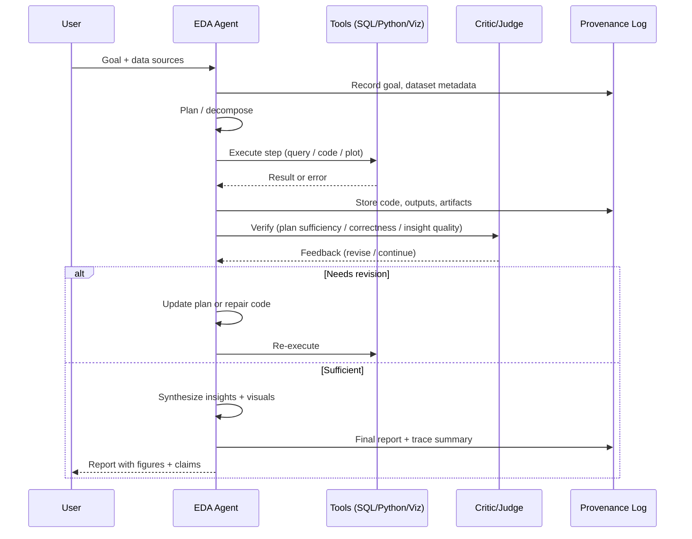

# State of the Art in Agentic Exploratory Data Analysis

## Executive Summary
Agentic exploratory data analysis (agentic EDA) is the application of large
language model (LLM) _agents_—systems that can plan, use tools (e.g.,
SQL/Python), iterate, and self-correct—to the open-ended, iterative work of
understanding data, generating visual/statistical probes, and synthesizing
insights into reports or decisions. Recent surveys define "LLM-based data
agents" as autonomous or semi-autonomous systems that interpret natural-language
goals, plan/execute data-centric tasks, and interact with external tools across
workflows from EDA to modeling. citeturn15search4turn15academia42

From 2023–2026, the field has moved from _prompt-only copilots_ toward
architectures that add (i) systematic planning and decomposition (including
graph-based task structures), (ii) tool-execution feedback loops (self-debugging
and verification), and (iii) retrieval/knowledge-grounding (semantic models,
notebook retrieval, and skill libraries). This shift is visible in (a) benchmark
pressure—multi-step "data agent" tasks remain hard (e.g., very low best-agent
accuracy on DABStep's hardest settings) citeturn2search1turn2search4 and (b)
the emergence of systems that explicitly optimize plan quality, verification,
and provenance, such as DS-STAR's plan-sufficiency judge and iterative
refinement citeturn4search0turn5search24, RAGvis's knowledge-graph–grounded
EDA operation retrieval plus self-correcting code execution
citeturn7view0turn9view0, and agentic-model training efforts like
DeepAnalyze-8B that claim end-to-end autonomy from raw data to "analyst-grade"
reports with an agentic training paradigm.
citeturn18search30turn18search0turn18search3

On the industry side, conversational analytics products increasingly rely on
_governed semantic layers_ (e.g., LookML, Snowflake semantic models, Databricks
Unity Catalog) to constrain and ground analytics, while also embedding
agent-like loops into notebooks/BI surfaces (e.g., Databricks "Data Science
Agent", BigQuery "data agents", Copilot in Power BI).
citeturn11search2turn11search0turn14search2turn3search2turn3search1

Evaluation is rapidly maturing: benchmarks now span (i) single-file
code-and-answer tasks (DA-Code, DataSciBench), citeturn2search2turn10search3
(ii) open-ended scientific or business "insight discovery" with partial-credit
scoring (BLADE, InsightBench/InsightEval),
citeturn10search1turn17view1turn5search2 (iii) heterogeneous multi-source
pipeline orchestration (KramaBench, FDABench), citeturn5search5turn2search11
and (iv) visualization generation/selection (VisEval, RAGvis).
citeturn5search3turn9view0

Key near-term research needs cluster around: reliable evaluation for open-ended
insight quality (beyond LLM-judges); systematic provenance and reproducibility;
secure tool use (sandboxing, least privilege, prompt-injection resistance); and
adaptive skill/tool selection that scales to real enterprise stacks.
citeturn5search2turn12search2turn12search3turn12search25turn16academia43

## Definitions and Scope of Agentic EDA
Exploratory data analysis (EDA) is the iterative process of understanding a
dataset (structure, quality, distributions, relationships), forming hypotheses,
and using lightweight statistical/visual probes to surface patterns and
anomalies—often before formal modeling. Agentic EDA extends this by giving an
LLM an _operational role_: the system can decide what to do next, execute
actions in tools, and revise its approach based on intermediate results.

A widely used data-agent definition (from surveys) frames an "LLM-based data
agent" as autonomous or semi-autonomous software that understands
natural-language instructions, plans and executes data tasks, and interacts with
tools to achieve objectives "from exploratory data analysis to machine learning
model development." citeturn15search4

In practice, "agentic EDA" typically includes some (not always all) of the
following autonomy and tooling elements:

- **Iterative planning and decomposition** (e.g., decide which diagnostics/plots
  to run; break tasks into sub-questions). citeturn4search0turn17view1
- **Tool use with execution feedback** (Python/SQL execution, error fixing,
  re-running). citeturn3search0turn7view0turn14search2
- **Insight synthesis** (structured reports with claims backed by computed
  outputs). citeturn5search24turn18search30
- **Visualization selection/generation** as a first-class activity (not just
  "pretty plots," but semantically correct analysis operations and chart
  choices). citeturn5search3turn9view0
- **Memory / provenance / governance** (retain intermediate context, record tool
  traces, and ground queries on semantic definitions).
  citeturn17view1turn11search2turn6search1

It is useful to separate _agentic EDA_ from adjacent but distinct areas:

- **Conversational BI / NLQ**: natural-language questions translated into
  governed queries over a semantic model (e.g., LookML). This can be agentic,
  but is often "single-shot Q&A" rather than open-ended exploration.
  citeturn11search2turn11search0
- **NL2Vis**: generate a visualization given a natural-language spec (the spec
  is provided), while agentic EDA often includes _choosing_ what to visualize
  without a precise user spec. citeturn5search3turn9view0
- **Autonomous data science / ML engineering**: broader pipelines that include
  feature engineering/modeling/experimentation; agentic EDA is a core sub-loop
  that these systems frequently emphasize.
  citeturn4search0turn6search2turn18search30

## Research Systems and Representative Papers
The table below focuses on systems/papers that materially shaped agentic EDA
capabilities, architectures, or evaluation between 2023–2026.

### Systems Comparison Table
| Name                        |      Year | Architecture type                                                         | Key features                                                                                                                                                                                                                                                             | Primary source                                    | Limitations / caveats                                                                                                                                                                                                  |
| --------------------------- | --------: | ------------------------------------------------------------------------- | ------------------------------------------------------------------------------------------------------------------------------------------------------------------------------------------------------------------------------------------------------------------------ | ------------------------------------------------- | ---------------------------------------------------------------------------------------------------------------------------------------------------------------------------------------------------------------------- |
| LIDA                        |      2023 | LLM pipeline for visualization + narrative                                | Modular pipeline (summarization/goal exploration/vis generation/infographics); positioned as a "language interface for data analysis." citeturn0search15                                                                                                              | citeturn0search15turn0search16                | Primarily prompt/pipeline-driven; evaluation/faithfulness remains challenging; can be brittle on schema ambiguity and complex tasks. citeturn9view0                                                                 |
| Data Formulator 2           |      2024 | Human-in-the-loop visualization + transformation assistant                | Interactive "create chart by describing intent" workflow; emphasizes iterative transformation with AI assistance. citeturn0search19                                                                                                                                   | citeturn0search19                              | Not designed as a fully autonomous agent; relies on UI interaction and user steering (by design). citeturn0search19                                                                                                 |
| InfiAgent-DABench / DAAgent |      2024 | ReAct-style tool-executing agent benchmark + baseline agent               | Benchmark explicitly for LLM agents on data analysis tasks with an execution environment; includes automated evaluation via "closed-form" formatting. citeturn2search0turn2search21                                                                                  | citeturn2search0turn2search6                  | Dataset size is modest relative to real workloads; still limited in heterogeneity vs multi-source enterprise settings. citeturn2search0                                                                             |
| DA-Code / DA-Agent          |      2024 | Executable data-science code-gen benchmark                                | 500 tasks across wrangling/ML/EDA with executable environment; SOTA LLMs + baseline agent reach only ~30.5% accuracy in reported experiments. citeturn2search2                                                                                                        | citeturn2search2                               | Strong dependence on coding/grounding; evaluation focuses on correctness rather than "insight quality" in open-ended sense. citeturn2search2turn10search3                                                          |
| DS-Agent                    |      2024 | Agent + case-based reasoning for end-to-end data science                  | Uses case-based reasoning (CBR) to structure iterative improvement using prior "cases" (e.g., Kaggle knowledge). citeturn10search0turn10search20                                                                                                                     | citeturn10search0turn10search20               | More focused on model-building than pure EDA; quality depends on case retrieval and domain match. citeturn10search0                                                                                                 |
| LAMBDA                      |      2024 | Multi-agent roles (programmer + inspector) + UI intervention              | Open-source "code-free" multi-agent data analysis system with programmer/inspector roles; supports user intervention and "knowledge integration mechanism." citeturn16search0turn16search1                                                                           | citeturn16search0turn16search3turn16search1  | Practical reliability depends on safe execution and human oversight; system-level rigor varies by task and tooling setup. citeturn16search0                                                                         |
| InsightBench / AgentPoirot  |      2024 | Multi-step "insight discovery" agent benchmark + baseline agent           | 100 business datasets with planted insights; evaluates end-to-end analytics: propose questions → interpret → summarize insights + actions; uses LLM-based evaluator (LLaMA-3-Eval). citeturn17view1                                                                   | citeturn17view1turn4search12                  | Synthetic data may not capture all real enterprise messiness; LLM-as-judge evaluation can drift or encode biases; still an open research issue. citeturn17view1turn5search2                                        |
| AgentAda                    |      2025 | Skill-library selection + RAG-based matcher + code generator              | Learns/uses "analytics skills" from a library; pipeline: question generator → RAG skill matcher → code generator; introduces KaggleBench for evaluation and reports preference-based human eval. citeturn16academia43                                                 | citeturn16academia43                           | Skill coverage/curation becomes the bottleneck; evaluation of "insightfulness" remains hard to automate at scale. citeturn16academia43turn5search2                                                                 |
| RAGvis                      |      2025 | KG-grounded EDA retrieval + self-correcting coding agent                  | Offline: build/enrich EDA knowledge graph from notebooks; Online: retrieve+align EDA ops for new dataset, refine with LLM, generate+execute+fix code; reports near-100% pass rates and improved Recall@k vs LIDA on VisEval/KaggleVisBench. citeturn7view0turn9view0 | citeturn9view0turn7view0                      | Executes LLM-generated code (explicit safety warning); depends on notebook corpus quality and taxonomy alignment. citeturn7view0turn12search3                                                                      |
| Data Interpreter            | 2024–2025 | Graph-based hierarchical planning + programmable nodes + verification     | Uses hierarchical graph modeling for task decomposition and "programmable node generation" for refinement/verification; reports large improvements on data-agent benchmarks (e.g., InfiAgent-DABench). citeturn14search6turn14search0                                | citeturn14search0turn14search6                | Strong claims rely on evaluation setup and benchmark coverage; system complexity raises reproducibility and monitoring needs. citeturn6search1turn14search6                                                        |
| DS-STAR                     |      2025 | Multi-agent pipeline + plan sufficiency verification loop                 | Adds (i) data file analysis across heterogeneous formats, (ii) LLM judge verifying plan sufficiency, (iii) sequential plan refinement; reported SOTA on DABStep, KramaBench, DA-Code. citeturn4search0turn5search24                                                  | citeturn4search0turn5search24                 | Higher accuracy can come with higher cost/latency due to iterative refinement; verification depends on judge reliability. citeturn4search0turn9view0                                                               |
| DeepAnalyze-8B              |      2025 | _Agentic model_ (trained for orchestration) + open-source model/code/data | Proposes curriculum-based agentic training with data-grounded trajectory synthesis; claims end-to-end autonomous data science and open-sources model/code/training data. citeturn18search30turn18search0                                                             | citeturn18search30turn18search0turn18search3 | As with any agentic code-executing system: needs safe sandboxing, careful tool constraints, and robust evaluation; practical generalization and bias remain active research topics. citeturn12search3turn12search2 |
| TiInsight                   |      2024 | Staged EDA system (clarify/decompose → text-to-SQL → visualization)       | Production-oriented cross-domain EDA system: hierarchical data context generation, question clarification/decomposition, text-to-SQL, visualization; claims strong text-to-SQL accuracy on standard benchmarks. citeturn16academia42                                  | citeturn16academia42                           | More "EDA via SQL+chart" than general agentic EDA; depends on database schema modeling and intent clarification quality. citeturn16academia42                                                                       |
| AgenticData                 |      2025 | Agentic analytics over heterogeneous data                                 | Proposed as an "agentic data analytics system for heterogeneous data" (CoRR). citeturn20view0                                                                                                                                                                         | citeturn20view0                                | Insufficient detail here to characterize the full stack without deeper paper review; treat as representative of the "heterogeneous data agent" direction. citeturn20view0turn2search11                             |

### Additional Notes on "state of the art" Claims
"State of the art" is benchmark-dependent, and papers increasingly report SOTA
in specific regimes:

- **Multi-step heterogeneous analytics**: DS-STAR explicitly reports SOTA across
  DABStep, KramaBench, and DA-Code. citeturn4search0turn5search24
- **Insight discovery**: InsightBench introduces an end-to-end benchmark +
  baseline agent AgentPoirot, but InsightEval argues InsightBench has flaws and
  proposes revised criteria and metrics—illustrating that "SOTA" can be unstable
  when the benchmark itself is evolving. citeturn17view1turn5search2
- **EDA visualization operation selection + reliability**: RAGvis reports
  substantial improvements over LIDA (Recall@k), near-100% code pass rates, and
  assesses visual quality via VLM-as-judge. citeturn9view0turn7view0
- **Model-level agentic autonomy**: DeepAnalyze claims advantage over
  "workflow-based" agents using proprietary LLMs, using an agentic training
  approach and releasing model/code/data. citeturn18search30turn18search0

## Industry Products and Platforms
Agentic EDA capabilities increasingly ship as "analytics agents" embedded into
the data stack: notebooks, BI tools, warehouses, governance layers, and
cloud-centric "data agents."

Below, "agentic" typically appears as: (i) conversational interfaces grounded by
a semantic model, (ii) generated SQL/Python with execution, (iii) iterative
refinement/error fixing, and (iv) governance/provenance features (catalog
grounding, logging, admin controls).

### Representative Product Directions (official Docs / Blogs)
**entity["company","OpenAI","ai research company"]**: ChatGPT's "data
analysis" experience supports interactive tables/charts from uploaded data, and
is positioned as a way to explore and visualize datasets in-chat.
citeturn3search0 Separately, OpenAI's "Deep research" guide describes models
optimized for browsing/searching and analysis, with support for tools including
web/file search and a code interpreter tool. citeturn3search19

**entity["company","Microsoft","technology company"]**: Copilot in
Fabric/Power BI is positioned to "transform and analyze data, generate insights,
and create visualizations and reports," including a standalone Copilot
experience for finding and answering questions about data sources accessible to
the user. citeturn3search5turn3search1 (Tenant controls and operational
constraints are emphasized in enabling docs, reflecting enterprise governance
concerns.) citeturn3search24

**entity["company","Google Cloud","cloud platform"]**: BigQuery supports
"data agents" that carry table metadata and instructions to answer questions
about selected tables/views/UDFs, indicating a first-party agent abstraction
connected to warehouse objects. citeturn3search2 Looker's Conversational
Analytics explicitly uses Gemini and the LookML semantic model as the "source of
truth" for consistent metric definitions, emphasizing semantic grounding as a
core reliability strategy. citeturn11search2turn11search23

**entity["company","Databricks","data platform company"]**: Databricks
"AI/BI" and "Genie spaces" describe a conversational interface that domain
experts configure with datasets, sample queries, and guidelines; Genie can
translate business questions into analytical queries and produce visualizations,
and continues updating as data/questions evolve.
citeturn3search4turn3search8 Databricks' "Assistant Data Science Agent" blog
describes an "autonomous partner" in notebooks/SQL editor that explores data,
generates/runs code, and fixes errors, grounded in Unity Catalog.
citeturn14search2

**entity["company","Snowflake","cloud data platform company"]**: Cortex
Analyst is described as a managed NL-to-structured-data analytics capability
available via REST API and based on a "Semantic Model," aimed at reliable
answering over structured data. citeturn11search0turn11search3 Cortex Agents
are positioned as orchestration that can call tools like Cortex Analyst and
Cortex Search, bridging structured + unstructured within the Snowflake
perimeter. citeturn11search3turn11search21turn11search28

**entity["company","Amazon Web Services","cloud provider"]**: Amazon Q in
QuickSight supports natural language querying and adding visuals/dashboards via
"Ask" experiences; QuickSight Topics act as a semantic index mapping terms to
fields/values to generate correct answers.
citeturn11search4turn11search10turn11search29

**entity["company","Tableau","business intelligence software"]**: Tableau
Agent is positioned as a conversational assistant to explore data, create
visualizations, and uncover insights; official help docs emphasize using the
assistant alongside the Tableau UI for faster visual analysis.
citeturn11search5turn11search16

**entity["company","NVIDIA","semiconductor and ai company"]**: Security
guidance for sandboxing agentic workflows stresses isolating code execution,
minimizing exposed secrets, and enforcing least privilege—highly relevant to
analytics agents that run generated code. citeturn12search3

### Industry Pattern: Semantic Grounding as "anti-hallucination infrastructure"
Across warehouses/BI tools, a consistent reliability theme is **semantic
grounding**: the agent is constrained by curated metric definitions, table
metadata, governance catalogs, and controlled query surfaces (e.g., LookML,
Snowflake semantic models, QuickSight topics, Databricks catalog).
citeturn11search2turn11search0turn11search10turn14search2 This aligns with
research findings that "tool orchestration and multimodal reasoning remain
unresolved challenges" and that many systems still lack explicit trust/safety
mechanisms—creating pressure for enterprise-grade constraints.
citeturn15academia42turn13view0

## Common Architectures and Component Stacks
Most agentic EDA systems can be described as variations on a
**plan–act–observe–reflect** loop, with explicit components for planning, tool
routing, memory/provenance, and synthesis. Surveys covering dozens of data
science agents highlight planning style, tool orchestration depth, and
trust/safety mechanisms as key cross-cutting design dimensions.
citeturn13view0turn15search0

### Core Components
**Planner / decomposer.**  
High-performing systems often make planning explicit (and revisable). DS-STAR's
core idea is a sequential plan that starts simple and is iteratively refined
until a judge verifies "sufficiency." citeturn4search0turn5search24 Data
Interpreter formalizes a graph-based decomposition structure (hierarchical graph
modeling) to manage dependent subproblems and dynamic intermediate data.
citeturn14search6turn14search8

**Tool-use layer (SQL/Python/visualization).**  
Tool execution is the defining capability separating "agentic" from pure chat.
In practice, this includes Python environments (notebooks/sandboxes), SQL
engines, and plotting libraries.
citeturn3search0turn14search2turn7view0turn11search0

**Memory and workspace.**  
"Memory" here includes retained dataset summaries, derived tables, intermediate
code/results, and retrieved artifacts (e.g., notebook snippets). DeepAnalyze's
demo emphasizes a workspace that can manage heterogeneous files and export
reports. citeturn18search5turn18search0

**Critic / verifier / judge.**  
A prominent 2024–2026 direction is _verification-centric agents_: plan
sufficiency judges (DS-STAR), citeturn4search0 code-execution pass-rate
objectives and self-correction (RAGvis), citeturn9view0 and LLM-as-judge
evaluation for insight quality (InsightBench, InsightEval).
citeturn17view1turn5search2

**Visualization engine.**  
RAGvis treats EDA as a sequence of semantically typed operations and evaluates
recall against a taxonomy of EDA operations and chart attributes, plus visual
quality via a VLM judge. citeturn9view0turn7view0 VisEval provides a
benchmark for visualization generation methods (NL2Vis) with labeled ground
truth. citeturn5search3turn5search18

**Provenance and logging.**  
Reproducibility requires capturing prompts, tool calls, intermediate data
artifacts, and environment metadata. Evaluation frameworks like Kaggle
Benchmarks explicitly focus on structured task definitions and reproducible
runs. citeturn6search1turn6search4 InsightBench reports multi-seed runs and
documents evaluation metrics/prompt details to support reproducibility.
citeturn17view1

### Typical Architecture Diagram

This abstraction maps cleanly onto many concrete systems: DS-STAR's plan
verification loop (P↔C), citeturn4search0 RAGvis's retrieval of EDA ops +
self-correcting code execution (R/T/PY/VIZ/C), citeturn7view0turn9view0 and
AgentAda's skill matcher + code generator (R plus a "skill library" tool
selection layer). citeturn16academia43

### Agent Loop Diagram

### Visual Grounding Examples
image_group{"layout":"carousel","aspect_ratio":"16:9","query":["DS-STAR data
science agent architecture diagram","RAGvis framework diagram knowledge graph
EDA","LIDA language interface for data analysis system diagram","Databricks
Genie conversational analytics visualization"],"num_per_query":1}

## Benchmarks and Evaluation Datasets
Evaluation is central because EDA is open-ended: there are many valid analysis
paths, "partially correct" plans, and multiple ways to express correct insights.
BLADE explicitly focuses on evaluating _approaches_ to open-ended research
questions (not just final numeric answers) and provides computational matching
methods to compare agent decisions to expert-derived ground truth.
citeturn10search1turn10search13

Recent benchmarks emphasize different slices of agentic EDA:

- **Executable correctness**: can the agent write/run correct code to produce a
  target answer? (DA-Code, DataSciBench). citeturn2search2turn10search3
- **Multi-step reasoning over data + docs**: can the agent iteratively process
  data and cross-reference instructions across steps? (DABStep).
  citeturn2search1turn2search4
- **End-to-end insight discovery**: can the agent decide what questions to ask
  and tell a coherent story? (InsightBench, InsightEval).
  citeturn17view1turn5search2
- **Pipeline orchestration across heterogeneous files/sources**: can the system
  design and execute a multi-stage pipeline from "data lake" to insight?
  (KramaBench, FDABench). citeturn5search5turn2search11
- **Visualization generation and semantic correctness**: can it pick/generate
  correct charts and code paths? (VisEval, RAGvis metrics).
  citeturn5search3turn9view0
- **Data governance tasks**: can it perform governance-oriented work
  (quality/correctness of data itself)? (DataGovBench). citeturn5search8

### Benchmarks Table
| Benchmark                  | Tasks                                                                                                                                                                                                      | Metrics (typical)                                                                                              | Link                                |
| -------------------------- | ---------------------------------------------------------------------------------------------------------------------------------------------------------------------------------------------------------- | -------------------------------------------------------------------------------------------------------------- | ----------------------------------- |
| InfiAgent-DABench (DAEval) | Agent-based analysis questions over CSVs with execution environment; questions are converted to closed-form for auto-eval. citeturn2search0turn2search21                                               | Accuracy / auto-graded outputs; success under tool execution. citeturn2search0                              | citeturn2search0turn2search6    |
| DA-Code                    | 500 agentic data science code tasks (wrangling/ML/EDA) in executable environment; best reported accuracy ~30.5%. citeturn2search2                                                                       | Exact correctness/accuracy in executable sandbox. citeturn2search2                                          | citeturn2search2                 |
| DSBench                    | Realistic data science tasks: 466 data analysis + 74 modeling tasks; reports low agent success rates and "relative performance gap." citeturn10search2turn10search30                                   | Task success rate; RPG and cost/time analyses (paper-dependent). citeturn10search30                         | citeturn10search2turn10search6  |
| DataSciBench               | Broad benchmark with semi-automated GT generation + Task–Function–Code evaluation framework; compares API and open models. citeturn10search3                                                            | Evaluation via precisely defined metrics/programmatic rules (TFC); model comparisons. citeturn10search3     | citeturn10search3turn10search7  |
| DABStep                    | 450+ multi-step data analysis challenges derived from a financial analytics platform; combines code-based data processing and reasoning over heterogeneous documentation. citeturn2search1turn2search8 | Accuracy; difficulty-stratified performance; strong performance gap reported. citeturn2search4turn2search8 | citeturn2search1turn2search4    |
| KramaBench                 | End-to-end "data lake to insight" pipelines; 104 challenges spanning 1700 files, 24 sources, 6 domains; evaluates orchestration. citeturn5search5turn5search9                                          | Pipeline correctness + intermediate step evaluation (framework provided). citeturn5search9turn5search16    | citeturn5search5turn5search9    |
| FDABench                   | 2,007 tasks for multi-source analytical scenarios combining structured and unstructured data; evaluates quality, accuracy, latency, token cost. citeturn2search11turn2search32                         | Response quality/accuracy; latency; token cost; system trade-offs. citeturn2search11                        | citeturn2search11                |
| InsightBench               | 100 business datasets with planted insights; evaluates end-to-end analytics and uses LLaMA-3-Eval as a primary metric. citeturn17view1                                                                  | LLM-as-judge insight similarity; ROUGE variants; multi-step scoring. citeturn17view1                        | citeturn17view1turn4search12    |
| InsightEval                | Expert-curated benchmark addressing shortcomings in InsightBench; proposes criteria and novel metrics for exploratory performance + novelty. citeturn5search2turn5search10                             | Insight metrics + novelty measurement; exploratory performance metric. citeturn5search2turn5search10       | citeturn5search2                 |
| BLADE                      | 12 datasets + research questions from scientific literature; ground truth from expert analyses; evaluates agent decisions on open-ended data-driven science. citeturn10search1turn10search13           | Automated matching to expert analyses; multifaceted evaluation beyond a single answer. citeturn10search1    | citeturn10search1turn10search13 |
| VisEval                    | Large NL2Vis benchmark (2,524 queries across 146 DBs) with labeled ground truth and automated evaluation toolkit. citeturn5search0turn5search3                                                         | Execution/semantic correctness of generated visualizations; toolkit support. citeturn5search3turn5search22 | citeturn5search3turn5search22   |
| AIDABench                  | End-to-end data analytics benchmark with 600+ tasks across question answering, visualization, and file generation. citeturn2search28                                                                    | End-to-end task completion across modalities (paper-defined). citeturn2search28                             | citeturn2search28                |
| DataGovBench               | Data governance tasks grounded in real-world scenarios; targets correctness/quality of data itself, beyond answer generation. citeturn5search8                                                          | Task success across governance workflows (paper-defined). citeturn5search8                                  | citeturn5search8                 |

### Evaluation Toolchains and Reproducibility Infrastructure
Beyond benchmark datasets, **evaluation harnesses** are appearing as
products/community infrastructure. Kaggle's Benchmarks initiative and the
`kaggle-benchmarks` library emphasize reproducibility by capturing
inputs/outputs and providing a structured framework for tasks and assertions.
citeturn6search1turn6search4turn6search12 This kind of harness is directly
useful for agentic EDA, where stochasticity and hidden intermediate steps
otherwise make comparisons unreliable.

## Capabilities, Failure Modes, and Research Agenda

### Typical Capabilities of Agentic EDA Systems
Across research systems and products, common "agentic EDA" capabilities cluster
into recurring task families:

1. **Data access and understanding**

- Load and inspect diverse data artifacts (CSV, logs, documents; sometimes
  databases). citeturn4search0turn18search5turn17view1
- Summarize schema/column semantics and detect data quality issues. DS-STAR
  emphasizes automatic exploration and context extraction across diverse
  formats. citeturn4search0turn5search24
- In enterprise tools, this is mediated by catalogs/semantic layers (LookML,
  semantic models) for consistent definitions.
  citeturn11search2turn11search0

2. **Exploration probes: statistics + visualization**

- Produce univariate/bivariate/multivariate plots and summary tables; RAGvis
  explicitly models EDA operations with a taxonomy and evaluates semantic
  correctness (Recall@k, pass rate). citeturn9view0
- Generate visualization recommendations, often using benchmarks like VisEval or
  internal notebook corpora. citeturn5search3turn9view0

3. **Iterative, multi-step reasoning**

- Multi-step sequences that combine code-based transformations with contextual
  reasoning over documentation. DABStep is explicitly built to test this.
  citeturn2search1turn2search4
- Plan refinement and verification loops (DS-STAR) or graph-based decomposition
  for dynamic dependencies (Data Interpreter). citeturn4search0turn14search6

4. **Insight discovery and reporting**

- Generate narrative insights and recommended actions (InsightBench:
  descriptive/diagnostic/predictive/prescriptive insights). citeturn17view1
- Produce "analyst-grade" structured reports and exportable artifacts
  (DeepAnalyze demo explicitly supports Markdown/PDF export).
  citeturn18search5turn18search30

### Common Failure Modes Observed in Benchmarks and Deployments
Agentic EDA failures are not just "hallucinations" in text—they're often
**workflow failures**: wrong plan, wrong tool choice, wrong query, or correct
code with incorrect interpretation.

**Low task success on realistic multi-step benchmarks.**  
DABStep reports a substantial performance gap, with very low accuracy for the
strongest agents in the published benchmark context, indicating that multi-step,
doc-grounded analytics remains unsolved. citeturn2search4turn2search8
DSBench similarly reports that even the best agents struggle, solving only a
minority of realistic analysis tasks (e.g., 34.12% of data analysis tasks in the
authors' evaluation). citeturn10search30 DA-Code reports low accuracy (~30.5%
for current best LLMs in their experiments), reinforcing that "execute correct
code end-to-end" is still hard. citeturn2search2

**Planning errors and "analysis myopia."**  
Multiple systems motivate themselves by arguing that LLMs produce suboptimal
plans or cannot verify plan sufficiency without ground truth—DS-STAR directly
targets this with plan verification. citeturn4search0turn5search24

**Tool-selection and retrieval brittleness.**  
Agents can fail by selecting the wrong tool or using the correct tool
incorrectly. This is not only a capability issue but also a security risk (see
below). citeturn12search1turn16academia43

**Code reliability vs semantic correctness trade-off.**  
RAGvis separates (i) retrieval of EDA operation intent and (ii) code
generation/execution, reporting near-100% pass rates while also measuring
semantic recall of EDA operations, illustrating that "runs without error" is not
the same as "correct analysis." citeturn9view0

**Evaluation misalignment and judge instability.**  
InsightBench uses LLM-based evaluation (LLaMA-3-Eval), while InsightEval argues
existing insight benchmarks have format/objective flaws and proposes new
criteria and metrics—highlighting that evaluation itself is an active research
frontier. citeturn17view1turn5search2

### Reproducibility, Safety, and Evaluation Recommendations
**Reproducibility and provenance**

- Treat agentic EDA as an _executable experiment_: log prompts, tool calls,
  code, dataset hashes/versions, random seeds, and environment details; many
  modern evaluation harnesses are built precisely to capture such structured
  runs. citeturn6search1turn6search4
- Prefer **programmatic metrics** (execution accuracy, exact match on computed
  outputs) where possible, and explicitly separate them from **insight-quality
  metrics** (novelty, usefulness, decision relevance), which often need hybrid
  evaluation (human + automated). citeturn10search1turn5search2turn17view1
- When using LLM-as-judge, run multi-judge or judge-calibration experiments and
  report sensitivity (model choice, prompt templates, order effects). The
  benchmark literature increasingly documents such evaluation strategies.
  citeturn17view1turn9view0

**Safety: sandboxing, least privilege, and prompt-injection resistance**

- Any agent that executes generated code must run inside strong isolation.
  RAGvis includes an explicit warning that it executes LLM-generated code on the
  local machine. citeturn7view0 NVIDIA's guidance emphasizes starting
  sandboxes with minimal secrets and injecting only task-scoped credentials
  through safer mechanisms. citeturn12search3
- Treat retrieved content as untrusted. The "Indirect Prompt Injection" line of
  work argues LLM-integrated applications blur data and instructions and can be
  exploited by injected prompts in retrieved data.
  citeturn12search2turn12search6
- Tool libraries themselves can be attack surfaces: ToolHijacker demonstrates
  prompt injection attacks that target tool selection by inserting malicious
  tool documents into a tool library. citeturn12search1
- Use layered defenses: policy constraints + tool allowlists + output
  validation + provenance logging. (Prompt injection is emphasized as a top risk
  in OWASP guidance.) citeturn12search25turn6search1
- If deploying broadly, evaluate "agent misuse" separately from "benign
  performance." AgentHarm provides a benchmark for harmful multi-step agent
  behavior, reflecting that agents can remain highly capable when jailbroken.
  citeturn12search0turn12search12

### Prioritized Short-term Research Agenda (concrete Projects/experiments)
The following projects are scoped to be feasible in months (not years), and to
produce publishable, actionable results.

**Project: Verification-first agentic EDA with measurable trade-offs**  
Build a DS-STAR–style verification loop (plan sufficiency judge + iterative
refinement) and evaluate systematically across DA-Code and DABStep. Report
Pareto curves: accuracy vs cost (LLM calls/tokens) vs latency, and ablate judge
types (LLM vs programmatic validators).
citeturn4search0turn2search2turn2search1

**Project: Provenance-native "analysis graph" standard + replayability**  
Implement a provenance "analysis graph" capturing dataset versions,
transformations, metrics, plots, and narrative claims, with one-click replay.
Compare user trust and debugging time against baseline notebook-only traces.
Ground evaluation using InsightBench-style planted insights and BLADE-style
approach matching to expert analyses.
citeturn17view1turn10search1turn6search1

**Project: Skill library vs free-form tool use**  
Replicate AgentAda's skill-matching approach and compare against "free-form code
generation" agents on insight discovery (InsightBench/InsightEval) and
code-oriented tasks (DA-Code). Measure: success, novelty, repeated-pattern bias,
and robustness to domain shift (new datasets/skilled methods).
citeturn16academia43turn17view1turn5search2turn2search2

**Project: Secure execution + prompt-injection red team for data agents**  
Construct a "data-agent prompt injection suite": inject malicious instructions
into (i) documentation, (ii) tool descriptions, (iii) dataset metadata/field
strings, and measure compromise rates (wrong tool, data exfiltration attempt,
policy violations). Evaluate defenses: strict tool allowlists, context
isolation, and sandbox credential brokering. Base threat models on established
prompt-injection work and tool-selection attacks.
citeturn12search2turn12search1turn12search3turn12search25

**Project: Unified benchmark slice for agentic EDA visualization correctness**  
Combine VisEval-style labeled visualization tasks with RAGvis's EDA-operation
taxonomy and pass-rate instrumentation. The goal is to separate: (a) correct
chart _semantics_ vs (b) correct code execution vs (c) visual readability. Use
RAGvis's metrics (Recall@k, Pass Rate@k, VLM score) as a starting template.
citeturn5search3turn9view0turn7view0

### Likely Near-term Trajectory (next 2–3 Years)
Several trajectories are strongly suggested by 2025–2026 evidence:

1. **From "prompt agents" to verification- and provenance-first agents.**  
   Benchmarks show large gaps on multi-step tasks (DABStep, DA-Code), motivating
   verification-centric designs (DS-STAR, RAGvis).
   citeturn2search4turn2search2turn4search0turn9view0 Expect verification
   modules, programmatic validators, and traceability to become standard, not
   optional.

2. **Enterprise analytics agents will converge around semantic grounding +
   governed tool surfaces.**  
   Looker's explicit use of semantic models as "source of truth," Snowflake's
   semantic models for Cortex Analyst, and Databricks' Unity Catalog grounding
   all point toward a convergent design pattern: constrain the agent's degrees
   of freedom using curated semantics and governance.
   citeturn11search2turn11search0turn14search2

3. **Tool ecosystems will standardize via protocols like MCP, increasing both
   capability and risk.**  
   The Model Context Protocol (MCP) was introduced as an open standard for
   connecting AI tools to data sources and has rapidly gained ecosystem support;
   OpenAI documents MCP support in its tooling guidance, and LangChain provides
   MCP integration/adapters.
   citeturn19search1turn19search9turn19search3turn19search10 This will
   accelerate agentic EDA by making "connectors" composable—but also expands the
   attack surface (prompt injection in tools/resources), increasing the
   importance of sandboxing and robust security posture.
   citeturn12search2turn12search1turn12search3

4. **Agentic EDA will bifurcate into two "SOTA" tracks:**

- **Model-centric autonomy** (agentic models trained for orchestration, e.g.,
  DeepAnalyze-8B) citeturn18search30
- **System-centric reliability** (retrieval + semantic modeling + verification,
  often with smaller models and stronger constraints, e.g., RAGvis showing
  competitive performance even with smaller open models in its evaluations)
  citeturn9view0

Surveys already note that many systems emphasize EDA/visualization/modeling
while neglecting trust/safety mechanisms; pushing SOTA will increasingly require
measurable safety and governance, not just accuracy.
citeturn13view0turn15academia42
